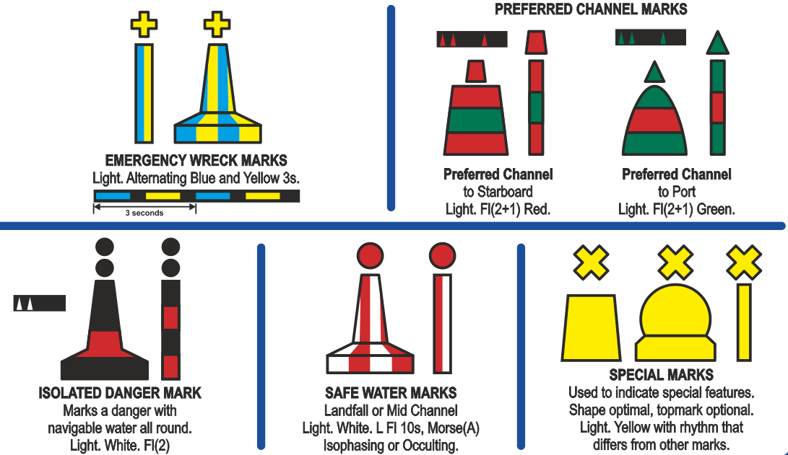
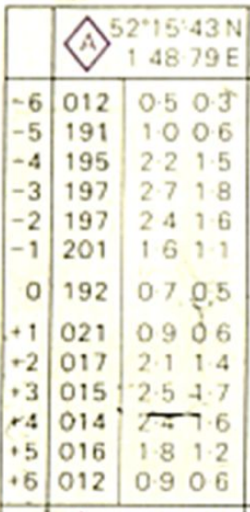

(Q01.01) Ģeogrāfiskais garums un platums. Koordināšu sistēma.

Zeme tiek dalīta paralēlēs (platums φ, N/S, 0°–90°)- Platums ir leņķis no zemes centra starp plakni, kas iet caur ekvatoru un apskatīto pun  
Zeme tiek dalīta  meridiānos (garums λ, E/W,   0°–180°).   
Garums ir leņķis starp plakni kas iet caur zemes asi un atrodas uz nultā meridiāna un mūsu apskatīto punktu.

Nulles meridiāns — Griniča( pie Anglijas) (λ = 0°); ekvators ir 0°platuma paralēle uz kuras atrodamies saucas ģeogrāfiskais platums! Koordinātes izsaka grādos, minūtēs, sekundēs vai decimalgrādos.  
Navigācijā izmanto elipsoīdu mērvienību - 1 jūras jūdze = 1 loka minūtei pa jebkuru meridiānu

(Q01.02) Merkatora kartes izveidošanas princips.

Globusu ieliek cilindrā, no centra spīdinot ar gaismas avotu, tā projekcija uz cilindra sienām rāda merkatora karti.

(Q01.03) Attāluma un ātruma mērvienības uz jūras.

Jūras jūdze (j.j) ≈ 1852 m.(ir viena minute pa meridianu, uz meridiāna) (jāzin no galvas )  
Ātrums 1 Mezgls (knot) = 1 J.J/h.  
1 kabeļtauva ≈ 1/10jūdzes ≈185 m.  
SOG (Speed Over Ground) = ātrums pa grunti;   
STW (Speed Through Water) = ātrums pa ūdeni.

(Q01.04) Magnētiskā variācija. Variācijas pievešana uz doto gadu.

Leņķis starp ģeogrāfisko ziemeļpolu un magnētisko ziemeļpolu. Katrā vietā cits un pārvietojas katru gadu, šobrīd brauc uz Krieviju. Uz navigācijas kartēm ir atzīmēta variācija punktā uz noteiktu gadu + šīs variācijas izmaiņas katru gadu. Savām lietošanas vajadzībām izrēķinam variāciju uz šodienu pirms to sākt lietot. Variācija ir “+” uz austrumiem un “–“ uz rietumiem.

(Q01.05) Kuģa deviācija. Kā sastādīt deviācijas tabulu?

Leņķis starp magnētisko polu  (meridiānu?) un kuģa iespaidu uz kompasu. Iebrauc jūrā un ar GPS pret esošo kompasu salīdzina rādījumus un katram kursam pieliek grādu nobīdi.

(Q01.06) Kuģa kurss (īstais kurss, kompasa kurss, magnētiskais kurss).

Īstais kurss (IK - true corse) - reālais virziens uz kartes - ir leņķis starp ģeogrāfisko meridiānu un kuģa diametrālo plakni (liīniju kas iet cauri  kuģim).

Magnētiskais kurss (MK, magnetic course)  - kurss uz mag. ziemeļiem (atņemam variāciju) -   leņķis starp magnētisko polu (plakni) un diametrālo plakni ņemot vērā (tātad bez deviācijas ietekmes).  
Kompasa Kurss (KK - Compass Course ) – kurss ko rāda kompas (no MK atņemam deviāciju) -  leņķis starp magnētu un diametrālo plakni. 

(Q01.07) Kas ir drifte? Driftes leņķa noteikšana.

Drifte ir leņķis starp īsto kursu un kuģa nonesumu vēja ietekmē. Skaita absolūtu skaitli, leņķa zīme +, ja pa labi, -, ja pa kreisi. 

(Q01.08) Straumes trīsstūra konstruēšana.

Vektoru summa: Uz/No Kuģa ceļa tiek nolikts straumes vektors grādos(katru gadu tiek izdotas PB tabulas un straumju kartes, katram rajonam, kurā ir paisumi un bēgumi) tad straumes ātrums un tiek atmērītas jahtas noietais attālums(J.J.) un tiet atlikts uz kuģa   
Zīmē: no sākuma STW; no tā gala pievieno straumi; savieno ar sākumu — iegūsti grunts vektoru SOG(patiesais ceļš pa cieto grunti)

(Q01.09) Jahtas  atrašanās vietas noteikšana pēc krasta objektiem ar dažādām metodēm. 

1) pēc divu objektu peilējuma – nomēram leņķi uz katru no objektiem un velkam koriģētās līnijas uz kartes. Krustpunkts būs mūsu punkts  
2) trīs objektu peilējumi. Kā 1) tikai trijstūra vidus būs mūsu atrašanās vieta  
3) pēc dubultpeilējuma. Nomēram leņķi vienrreiz, tad pēc noteikta attāluma nomēram vēlreiz. Uzzīmējam abus leņķus, mūsu kursu un attālumu atzīmējam no pirmā punkta un zīmējot paralelogramu atrodam tādu līniju starp pirmo un otro peilējumu, kura garums ir mums vajadzīgais.

(Q01.10) Peilēšana. Jahtas vietas noteikšana pēc divu bāku peilējuma.

Ar peilkompasu/kompasu nomēri divus peilējumus pēc dažādām bākām +     noietas Jūdzes(pēc formulas)  
Katrai līnijai piemēro variāciju/deviāciju (delta K) un atzīmē kartē; krustpunkts = pozīcija(observācija)Starplaikos jāņem vērā straumi/drifti.

(Q01.11) Ortodromija un loksodromija, to piemērošanas praktiskie aspekti.

Ortodromija – taisnākais ceļš uz globusa, uz merkatora kartes liekta līnija  
Loksodromija – taisnākais ceļš uz merkatora kartes, uz globusa līkne un ja to turpina, tad sanāk spirāle. Maza mēroga kartē jāņem vērā, ka taisnu līniju vilkt nebūs pareizi. Lielus pārgājienu sbūtu jāplāno mazākos soļos un izmantojot kartes lokālo mērogu. Kādi vēl ir praktiskie aspekti?

(Q01.12) Redzamais horizonts un tā attālums. Bāku atklāšanās attālums. 

Tas ir attālums, kurā sākam redzēt objektu. To ietekmē gan mūsu acu augstums virs horizonta un bākas augstums virs horizonta. Formulā tiek ņemts vērā gan zemes izliekums, gan atsmofēras refrakcija, kas “pietuvina” objektus. Uz kartes mēdz dot redzamības attālumu 5m augstuma novērotājam, lai iegūtu jahtai vajadzīgo atņem 2jj. Vienkāršākais veids – 2 x kvardrātsakne no augstuma.

(Q01.13) Kardinālās sistēmas bojas (krāsojums, uguņi, topa figūras)  
   
Bojas, kas apzīmē apkuģošanas ceļu ap šķēršliem (pastāvīgiem). Piemēram Ziemeļu boja ir uz ziemeļiem no šķēršļa. Ziemeļu bojai jāiet garām pa ziemeļu pusi.  
 

Trijstūri uz augšu (N) - ziemeļi - 12x uzliesmojumi   
Trijstūra virsotne katra uz savu (E) pusi - 3x uzliesmojumi, garām iet pa labo pusi   
Trijstūri uz leju (S) - dienvidi - 6x uzliesmojumi + 1x garais uzlismojum  
Trijstūri virsotnē viens pret otru (W) - 9x uzliesmojumi, garām iet pa kreiso pusi 

Krāsojums – trijstūra virsotnes apzīmējums ir melns, leju - dzeltena.   
Trijstūri uz augšu - melns / dzeltens.  
Trijstūris uz leju – dzeltens / melns 

Bojas + 4x : 

* Isolated danger marks (2x melni punkti, melns-sarkans-melns) - atsevišķas bīstamības bojas, iet garām pa jebkuru pusi, neliek uz lielākiem šķēršļiem par 50 m   
* Safe water marks, pieņemšanas boja (sarkans punkts, baltas / sarkanas svitras) (kuģu ceļa ass boja) - boja kreisajā pusē, pēc pieņemšanas bojas sākas osta   
* Special marks (dzeltens krusts, dzletena boja), speciālas nozīmes boja - lieto militāriem rajoniem, dabas liegumi.  
* Emergency wreck marking buoy (dzeltens krusts, dzeltena/ zila strīpu boja), avārijas vraku boja - apzīmē kuģus kurus plāno izcelt 

(Q01.14) Laterālā sistēma A un B, boju krāsojums, ugunis un topa figūras. 

Laterālās sistēmas bojas apzīmē kuģu ceļu. A (EU). Pa kreisi no jūras ejot – sarkanas, pa labi zaļas. B (USA) - zalā kreisajā pusē, sarkana labajā pusē    
Kad miksētas krāsas, tad dominējošā krāsa nosaka kur aiziet kuģa ceļš, piemēram ja ir zaļi dominējošs, tad kuģa ceļš ir atstājot šo boju labajā pusē, bet vispār var braukt arī pa labi no bojas (atstājot kreisajā pusē)

(Q01.15) Plūdmaiņu rašanās principi. Sizigija un kvadratūra.

Ietekmē saules un mēness pozīcija pret zemi. Paisums ir ūdens uznākšana, bēgums – aiziešana.Paisumi-bēgumi ir 2xdienā  
Mēnesim ir 2x fāzes :

* Sizigija ( en : spring tide ) - debess ķermeņi vienā līnijā (zeme / mēnes / saule) - pilns mēnes, jauns mēnes, augsti paisumi bēgumi  
* Kvadratūra (en : neap tide) - ja mēnes ir augšā / lejā (90’ grādos)  - augoš mēnes , dilstoš mēnes  

(Q01.16) Atšifrēt šādus navigācijas uguņus: „Iso R 5s 11M”, „2Ldg F R 2M”, „Mo(A) 10s”, „Oc(3)10M”, „Fl(2)10s 29M”.

Bāka - apļi kartē, krāsas = balts / zaļš un sarkans,   
bākas raksturs :

* F (Fixed) - nepārtraukts  
* Oc (Occulting) - ar pārāvumu   
* Fl (Flash) - uzliesmojums uguns   
* Iso (isophase) - vienādfāžu   
* Ldg - vadlīnijas  
* Mo - morzas burts

Periods - no viena signala sākumu līdz nākamajam   
Vadlīnijas ir ievilktas kartēs

Piemēri (jāzin šie piemēri) :   
Iso R 5s 11M - izofāzes, sarkans, periods 5s, redzamība 11 jūdzes  
2Ldg F R 2M - vadlīniju uguns, patstāvīgs, srkans, redzamība 2 jūdzes  
Mo(A) 10s - pēc morzas burts (A), periods 10s   
Oc(3)10s 10M - aptumšojuma uguns, 3 aptumšojumi, periods 10s, redzamība 10 jūdzes   
Fl(2)10s 29M - zibšņu uguns, 2 zibšņi, periods 10s, redzamība 29 jūdzes  
			  
(Q01.17) Kā uz kartes atrast informāciju par paisumu – bēgumu straumes virzienu un ātrumu jūrā?

Uz katras kartes ir galvenā osta plūdmaiņām, pēc tā skatās kalendāro bēgumu, paisumu šajā ostā. 

1.  paņem ostas paisuma/bēguma karti UN paisuma bēguma kalendāru. atrod tuvāko high water (kalendārā \!). Nosakam vai esam prims vai pēc šī  
2. Atrod šī brīža pulksteni un pieliek -6 līdz +6 augstajam ūdenim  
3. Atrod uz kartes. Tur trīs kolonnas:  
- straumes virziens grādos (bold)  
- 0.9 - ātrums sizīgijā (+/- 2 dienas no pilna / tukša mēnes)  
- 0.6 - ātrums kvadratūrā (+/- 2 dienas no puss mēneša) tas uzzīmēts kā 0 9 0 6

Paisuma/bēguma kalendāru pērk iepriekšējā ostā pirms ieiešanas paisuma bēguma ostā.   
Dzīvē izmanto aplikāciju - Tides - visāda veida aplikācijas. Nekad nav pa velti

(Q01.18) Paisumu – bēgumu tabulu lietošana.

Atrod datumu un sakatas kalendārā, 

(Q01.19) Kursā uz kuģu ceļa redzams rajons iezīmēts ar zili-dzelteni vertikālām svītrām krāsotām bojām – ko tas nozīmē? 

Īslaicīgs vraka apzīmējums, kurš drīz tiks aizvākts.

(Q01.20) Atšifrēt šādus jūras dibena grunts apzīmējumus: Cy.M;  M.S.Sh; R.Sh.mS; M.S.Sh.G; M.S.R; 

Grunts nosaukumi : 

* Cy.M - māls (clay) , dūņas (mud)  
* M.S.Sh - dūņas, smiltis (sand), glimežvāki (shells)  
* R.Sh.mS - klints (rock), gliemežvāki, vidēja smilts   
* M.S.Sh.G - dūņas, smilts, gliemežvāki, grants (gravel)    
* M.S.R - dūņas, smilts, klints

