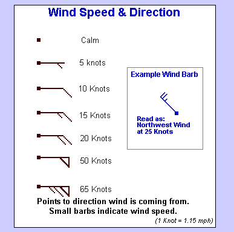
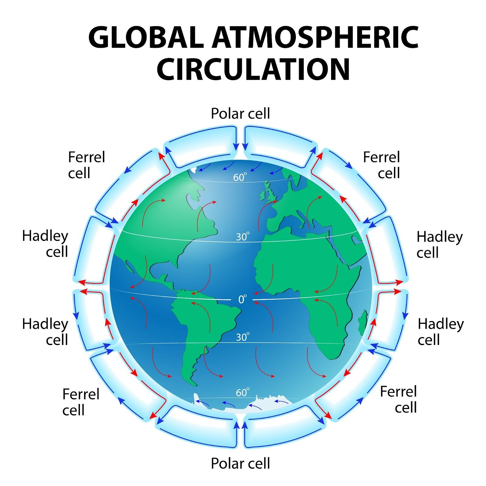
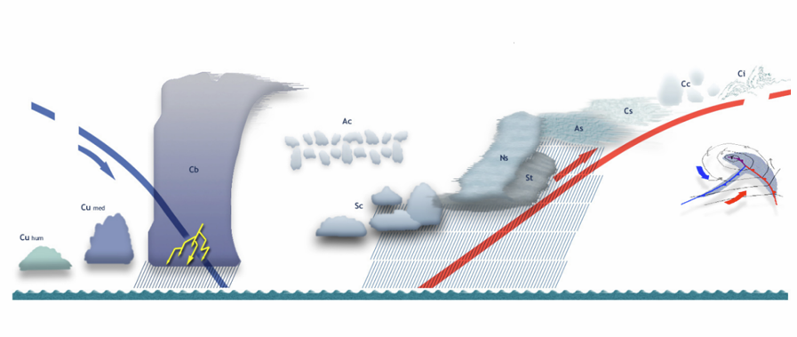
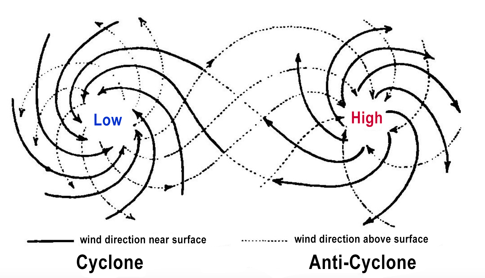

(Q03.01) Boforta skala. 

Vēja stiprumu raksturojoša skala, kas nosakāma pēc ārējiem apstākļiem, bez mērierīces. Sākot ar maziem vilnīšiem līdz “koki lūzt”. Skala no 1 līdz 12\. Ļoti rupji ņemot var reizināt ar 2, lai iegūtu metrus sekundē (un x2, lai iegūtu mezglus) (un x2 lai iegūtu km stundā )

(Q03.02) Vēja apzīmējumi uz sinoptiskās kartes. Vēja ātruma mērvienības un sakarība starp tām. 

(Q03.03) Laika prognozēšana. Meteo informācijas avoti.

Spiediena izmaiņas var izmantot laika prognozē. Strauja spiediena maiņa var paredzēt stipru vēju.  
Ciklons noiet 500 jūdzes diennaktī. Meteo informācijas avoti:  dzīve (novērojumi dabā) , navtex , īsviļņu rācijas (ostas kontrole 9 kanāls) , web lapas

(Q03.04) Globālie vēji un to rašanās mehānisms.  

Globālie vēji rodas nevienmērīgas Saules sasilšanas dēļ, kas rada spiediena atšķirības starp ekvatoru (zems spiediens) un poliem (augsts spiediens). Zemes rotācija (Koriolisa spēks) to novirza, radot trīs pastāvīgas cirkulācijas šūnas katrā puslodē.   
Ir triju veidu vēji :   
1\) Pasāti  (Easterly Trade winds)  - ir  pastāvīgi vēji, kuri visu gadu pūš virzienā uz ekvatoru: ziemeļu puslodē no ziemeļaustrumiem, bet dienvidu puslodē no dienvidaustrumiem.  
2\) Mēreno platumu rietumu vẽji (Westerly trade winds) - Šeit dominē Rietumu vēji (Westerlies), kas pūš no rietumiem uz austrumiem. Tie ir galvenie valdošie vēji mērenajos platuma grādos (tajā skaitā Latvijā).   
3\) Polaro apgabalu austrumu vēji (Easterly polar winds) - kas ir auksti, sausi vēji, kas virzās no austrumiem uz rietumiem.

(Q03.05) Tuvojošās vētras pazīmes;

Debesis un mākoņi = Strauja mākoņu maiņa – veidojas tumši, draudīgi gubu un lietus gubu mākoņi (īpaši rudenī un vasaras beigās). Pie horizonta strauji tuvojas “mākoņu kalni”. Sarkani vai ļoti spilgti  
saulrieti/ausmas – bieži norāda uz mitruma un vētras tuvošanos.  
Vējš = Vēja virziens mainās, tas kļūst brāzmaināks un neregulārāks. Pirms vētras jūtams pēkšņs,  
auksts gaisa vilnis. Jūras virsma sāk “vārīties” – veidojas nelieli viļņi ar baltām putām, pat ja  
pirms tam bija mierīgs. Jūra un daba = Spiediena pazemināšanās – jūrnieki to izjūt kā “smagumu gaisā”. Jūras ūdens kļūst tumšāks,  
viļņi pieaug.

(Q03.06) Pamata miglu veidi un to rašanās mehānisms.

Radiācijas migla (Iekšējo ūdeņu) = veidojas gaisam strauji atdziestot, zema un uz dažām stundām  
Advekcijas migla  (ārējo ūdeņu) = ilga, bieza, silts gaiss pāri aukstam ūdenim. Ciklona siltā fronte stumj pa priekšu. Var būt pat 24h  
.  
(Q03.07) Kā mainās debesis (mākoņi) tuvojoties ciklonam.

Tuvojoties ciklonam, mākoņi no augstiem, plāniem un viegliem pakāpeniski kļūst biezāki, zemāki un tumšāki, līdz sākas ilgstoši nokrišņi.tjen

(Q03.08) Nokrišņu raksturs siltajā un aukstajā frontē.

Siltā fronte. =  Nokrišņi sākas pakāpeniski, jau ilgi pirms pašas frontes. Tie ir ilgstoši, vienmērīgi (lietus, sniegs, smidzinošs lietus). Veidojas plaša nokrišņu zona – simtiem kilometru plata. Raksturīgi: vienmērīgi, ilgi nokrišņi.

Aukstā fronte. = Nokrišņi sākas strauji, tie ir īsi, bet spēcīgi. Bieži vien tie ir lietusgāzes, pērkona negaiss, krusa. Nokrišņu josla šaurāka nekā siltajā frontē (dažus desmitus km). Mākoņi: gubu mākoņi (Cumulonimbus) ar strauju vertikālu attīstību. Raksturīgi: stipras, īslaicīgas gāzes un pērkona negaisi. Siltā fronte → ilgi, mierīgi nokrišņi. Aukstā fronte → straujas, spēcīgas gāzes.

(Q03.09) Atmosfēras frontes. Kā un kur rodas cikloni Ziemeļatlantijā.

Cikloni ir zema spiediena apgabali ar rotējošu gaisa kustību (Ziemeļu puslodē – pretēji pulksteņa rādītāja virzienam). Tie rodas tur, kur satiekas kontrastējošas gaisa masas – visbiežāk Polāro gaisa masu un Siltā okeāna gaisa robežās. Īpaši bieži tas notiek Ziemeļatlantijas rietumu daļā (pie Ziemeļamerikas austrumu krastiem un pie Golfa straumes ietekmes zonas). Siltā un aukstā fronte savienojas, veidojot frontālo ciklonu. Ciklons pārvietojas uz austrumiem pāri Atlantijas okeānam, līdz sasniedz Eiropu. Kāpēc tieši tur? Golfa straume nodrošina siltu un mitru gaisu, kas kontrastē ar auksto Arktikas gaisu no Grenlandes un Kanādas.  
Šis straujais temperatūras kontrasts veicina ciklonu veidošanos.  
Ziemeļatlantijas zonā darbojas arī Polārie vēji (jet stream), kas palīdz attīstīt un pārvietot ciklonus.

(Q03.10) Ciklonu ceļi Ziemeļatlantijā. Ciklonu pārvietošanās ātrums un laika prognozēšana.

Cikloni Z-antlantijā rodas pie Ņūfandlendas un rietumu vēju nesti dodas uz Lielbritāniju Otra ļoti aktīva vieta ir Islandes minimums (pie Islandes, Grenlandes dienvidiem). Virzība pāri Atlantijas okeānam. Cikloni pārvietojas no rietumiem uz austrumiem pa mērenajiem platuma grādiem. To kustību nosaka rietumu vēji Ferrela šūnā un polārās frontes zona (ap 50–60° Z platumu). Tālākie ceļi Daļa ciklonu virzās uz Skandināviju un Baltijas reģionu → tieši šie visbiežāk ietekmē Latviju. Citi iet uz Britu salām, Centrāleiropu vai Krievijas ziemeļrietumiem. Ciklons šķērso okeānu četrās dienās, 500jj diennaktī

(Q03.11) Aparāti atmosfēras spiediena mērīšanai. Raksturīgās spiediena izmaiņu līknes ciklonā.

Barometrs, barogrāfs – dzīvsudraba staba augstuma  
Aneroīds – gofrētā kastīte maina izmēru kad spiež gaiss  
Raksturīgā spiediena izmaiņu līkne, kas novērota meteoroloģiskajā stacijā ciklona pārvietošanās laikā, parasti ir V-veida.

(Q03.12) Kā noteikt, kurā virzienā no mums atrodas ciklona centrs (Ziemeļu puslodē)?

Ja stāv ar muguru pret vēju ciklona centrs atradīsies pa kreisi. Ar seju pret vēju pa labi

(Q03.13) Globālo vēju rašanās un to virzieni ziemeļu puslodē.

Mēs dzīv. rietumu vēju pusē, lai uzzinātu kāds būs laiks mēs skatāmies uz rietumiem. Izņemot, ziemu, tad skatāmies uz austrumiem, jo augsts gaiss ir smags, jo vairāk atdziest Krievijā gaiss, tas stāv un bloķē rietumu vēju. Pie pola ir austrumu globālie vēji.

(Q03.14) Termiskie vēji. 

Termiskie vēji. Vējš pūš no aukstākas vietas uz siltāku. Dienā ir jūras brīze naktī -krasta brīze. Tas strādā papildus bāriskajam vējam. Ja vējš ir pretējs bāriskais vējš pavājinās. Latvijā termiskie vēji ir vāji jo nav krasas temp. Izmaiņas.

(Q03.15) Anticikloni.

Anticiklons- augsts spiediens.Paaugstinātajam apgabala pa lejas malu pūš pasāts pa augšējo – austrumu pasāts.  Pie ekvatora anticikloni pūs pretējā virzienā, bet gaisa masas pūš vienādi.  Z-puslodē anticiklons rotē pa pulksteņrādītāju virzienu

(Q03.16) Kādas pazīmes vētras laikā liecina par drīzu laika uzlabošanos?

Vēja maiņa – ja vējš kļūst mierīgāks un maina virzienu (piemēram, no dienvidiem/piekrastes uz rietumiem vai ziemeļrietumiem), tas norāda, ka ciklona centrs ir pagājis un tuvojas stabilāks gaiss.  
 Mākoņu retināšanās – blīvie, tumšie lietus mākoņi sāk izjukt, starp tiem parādās gaišākas joslas vai debesis. Nokrišņu mazināšanās – lietus kļūst retāks, pāriet īsos brīzos vai miglā.  
Gaisa spiediena celšanās – barometrs rāda, ka spiediens atkal sāk kāpt (pēc ciklona ieplakas pāriešanas).  
Redzamība uzlabojas – migla un nokrišņi mazinās, horizonts kļūst skaidrāks.  
Debesu gaišums rietumos – ja vētra pārvietojas uz austrumiem, tad rietumu pusē var ieraudzīt gaišākas debesis vai pat saules starus.

(Q03.17) Atmosfēras frontes un tajās raksturīgās laika parādības.

* siltā – stilts gaiss, maigs vējšš, vienalaidu mākoņi  
* aukstā – brāzmaini vēji, lietus nejauks  
* oklūzijas – saplūst, vnk lietus. Tas kas no nāk līdz mums

(Q03.18) Bīstamas laika parādības uz jūras. Negaiss.

Migla, jo nav redzamības. Ir ar ūdeni sasit. Divas miglas. 1\. Iekšējo ūdeņu migla un ārējo ūdeņu migla.  Ir radiācijas migla – viņa ir vasarās, kad strauji nokrītas temperatūra, rīta migla. Parasti veidojas pirms saullēkta. Bet tā ir īslaicīga un radiācijas migla ir lokāla. Tā nav uz jūras. Bet piekrastē ir, un tāpēc ieeju upē neredz. Otra ir jūrā un tā var būt ilgstoša – Advekcijas migla. Siltam gaisam pārvietojoties pāri aukstam ūdenim. Nāk siltās frontes ciklons, un tad nāk ļoti bieza migla vai otrādi var būt kas auksts gaiss nāk pāri siltam ūdenim, piem. rudenī, bet visbiežāk rodas nokrišņi.   
Negaiss – negaisa mākoņa tuvumā vējš pūtīs mākoņa virzienā. Lietus sākums ir negaisa beigas. Ja mākoņa apakšējā mala ir taisna, tad būs stiprs vējš. Zibens. Tornado, vēja virpuļi. 

(Q03.19) Izobāras. Sinoptisko karšu lasīšana.

Izobāras - līnija kas savieno punktus ar vienādu atmosfēras spiedienu.

(Q03.20) Laika prognozēšana pēc sinoptiskās kartes.

Zinot globālos vējus, varam prognozēt ciklona virzienu. Pēc frontes līniju garumiem un veidiem varam minēt, cik tālu tiks šī fronte un kad kļūs par oklūzijas fronti un vnk izjuks.   
