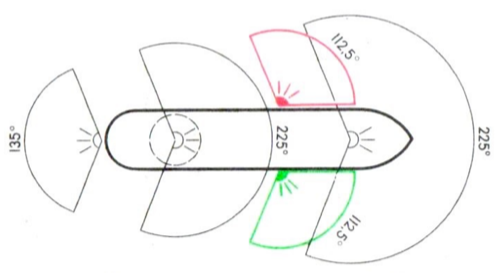
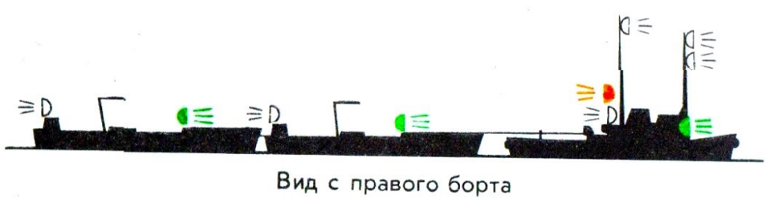
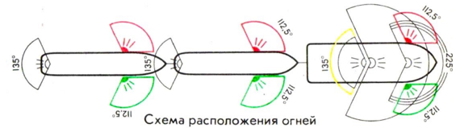
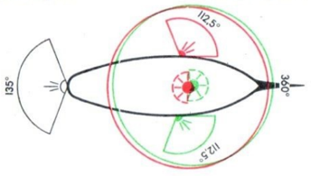
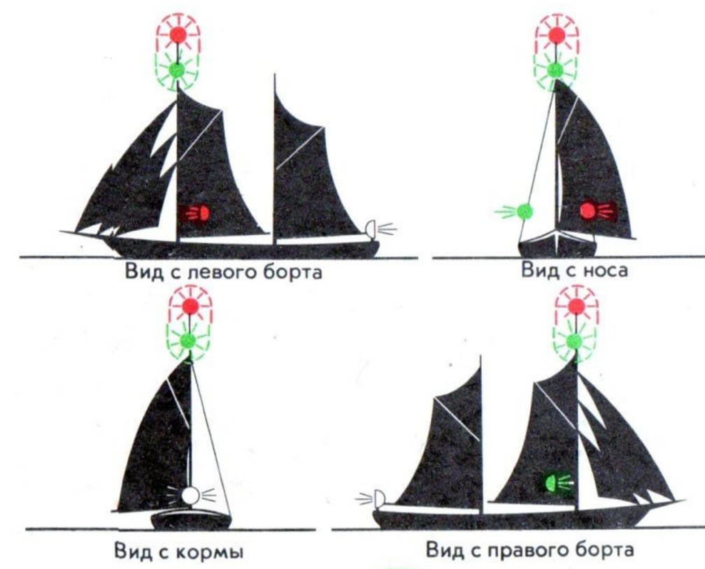
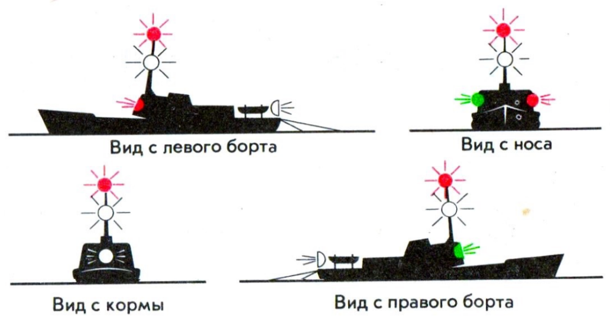
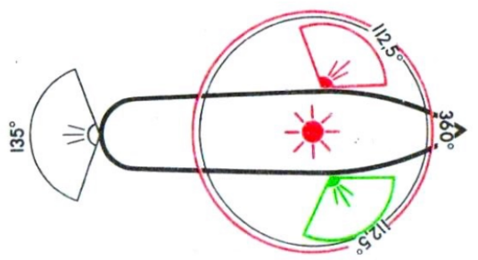
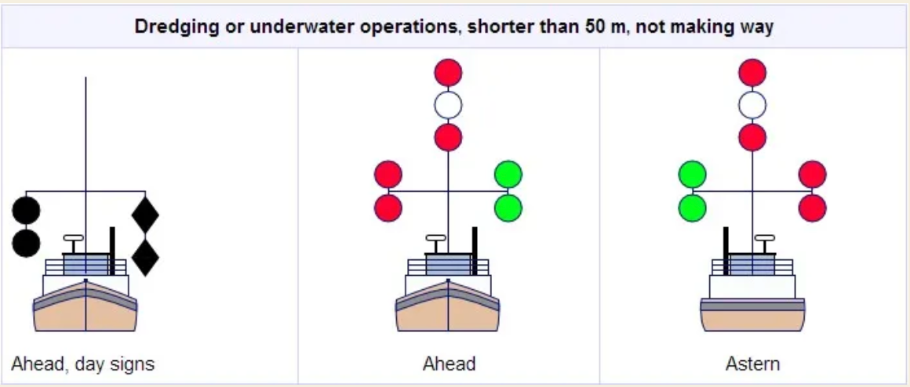

(Q04.01) Kādas ugunis naktī nes kuģis ar mehānisko dzinēju un kādus velkonis?

Kuģiem ar mehānisko dzinēju jāizliek:

* Topuguns priekšgalā  
* Otrs topuguns aizmugurē augstāk par priekšējo, kaut gan kuģis mazāks par 50m var to nenest.  
* Borta uguņi  
* Ahtera uguns

Kuģiem ar mehānisko dzinēju, kas nodarbināts vilkšanā, jāizliek:

* Kuģa priekšgalā, 2 vertikālā līnijā izvietotas topugunis; Ja velkamās tauvas garums no velkoņa priekšgala līdz velkamā pakaļgalam pārsniedz 200m, tad vertikālā līnijā jāizliek 3 topugunis.  
* Otrs topuguns aizmugurē augstāk par priekšējo,	  
* Bortu ugunis;	  
* Pakaļgala uguns;	  
* Vilkšanas uguns, kas novietota vertikālā līnijā virs pakaļgala uguns;

(Q04.02) Kādas ugunis naktī jānes buru kuģiem?

Buru kuģim gaitā jāizliek:

* Bortu ugunis;  
* Pakaļgala uguns;  
* Uz buru kuģa mazāka par 12m iepriekš minētie uguņi var tikt sakombinēti vienā lukturī un izvietoti masta topā.  
* Buru kuģis gaitā papildus šīm ugunīm masta aukšgalā vai tā tuvumā var izlikt divas vertikālā līnijā izvietotas riņķugunis (augšējā sarkana, apakšējā zaļa);  
* Buru kuģis, garums \<20m, iepriekš minētās ugunis var apvienot vienā kombinētā laternā, kura jāizliek masta aukšgalā vai tā tuvumā;  
* Buru kuģim, kura garums \<7m, iepriekš minēto uguņu vietā var izlikt baltu riņķuguni.  
* Kuģim, kas noenkurojies, vislabāk redzamā vietā jāizliek \-  balta riņķuguns vai bumba;

(Q04.03) Kādas ugunis naktī nes zvejas kuģi, kuri ir aizņemti zvejā?

Kuģim, kurš nodarbināts zvejā, izņemot kuģus, kas nodarbināti tralēšanā, jāizliek:

* Divas vertikālā līnijā izvietotas riņķugunis, no kurām augšējai jābūt sarkanai, bet apakšjai- baltai;  
* Ja izmestie zvejas rīki stiepjas horizontālā attālumā tālāk par 150m no kuģa, tad šo rīku virzienā jāizliek balta riņķuguns;  
* Ja kuģis pārvietojas (ir kustībā), tad papildus iepriekšminētajām ugunīm, jāizliek bortugunis un pakaļgala uguns;

(Q04.04) Kādiem kuģiem, normālas redzamības apstākļos, ir ceļa tiesības attiecībā pret buru kuģiem.

Buru kuģim gaitā ir jādod ceļš:

* Kuģim, kurš zaudējis vadības spējas;  
* Kuģim ar ierobežotu manevrēšanas spēju;  
* Kuģim, kurš nodarbināts zvejā.

(Q04.05) COLREG-72 briesmu signāli.

COLREG-72 4\. pielikums. AVĀRIJAS SIGNĀLI. Signāli izliekami kopā vai atsevišķi, TIKAI, ja kuģis ir briesmās un nepieciešama palīdzība. AIZLIEGTS izmantot citiem nolūkiem, kā arī dot līdzīgus signālus, kurus var pārprast.

* Lielgabala šāvieni vai citi sprāgstoši signāli ar \~1min intervālu.  
* Nepārtraukta skaņa no ierīces, kas paredzēta miglas signāla raidīšanai.  
* Raķetes vai Granāta ar sarkanām dzirkstelēm- izšaujot vai izmetot ik pēc neliela blaika rīža.  
* SOS skaņa (ooo \- \- \- ooo) pēc Morzes ABC caur rāciju vai no jebkāda cita signāla avota.  
* “M E I D E I” skaļi izrunāts vārds pa rāciju.  
* NC \- Starptautiskā signālu kodu briesmu signāls.  
* Signāls – Taisnstūra karogs ar bumbai līdzīgu priekšmet zem tā.  
* Liesmas (degšana- kontrolētas vai nekontrolētas) uz kuģa.  
* Sarkana raķete ar izpletni vai sarkana rokas signāl-lāpa.  
* Oranžas krāsas dūmi.  
* Lēna un atkārtota sāņus izstieptu roku pacelšana un nolaišana.  
* Rācijas DISTRESS signāls.  
* Avārijas vietas noteikšanas radio bojas.

(Q04.06) Kuģu satiksmes sadales sistēmas un kuģošana tajās. Kuģu ceļu šķērsošana.

Intensīvas kuģošanas rajonos, kur kuģu plūsmas virzās pretējos virzienos praksē bieži tiek noteiktas kuģu satiksmes sadales sistēmas. Kuģim, kas izmanto satiksmes sadales sistēmu:

* Jāpārvietojas atbilstošajā satiksmes joslā satiksmes plūsmas galvenajā virzienā;  
* Praktisko iespēju robežās jāturas sāņus no satiksmes sadales līnijas vai satiksmes sadales joslas;  
* Normālos apstākļos jāieiet un jāiziet no satiksmes sadales joslas tās galējos posmos, bet ja kuģis atstāj satiksmes sadales joslu vai ieiet tajā no malas, šis manevrs jāizdara iespējami šaurākā leņķī pret satiksmes plūsmas galveno virzienu;  
* Kuģim, cik tas praktiski iespējams jāizvairās no satiksmes joslu šķērsošanas, bet, ja tas spiests to darīt, tad iespēju robežās satiksmes joslu šķērsošanu jāizdara taisnā leņķī pret satiksmes plūsmas galveno virzienu;  
* Kuģi, kuru garums \<20m, buru kuģi un zvejas kuģi drīkst un vēlams izmantot piekrastes zonu;  
* Kuģim, kurš pārvietojas sadales sistēmas galējo posmu tuvumā, jāievēro īpaša piesardzība;  
* Cik iespējams, jāizvairās no enkurošanās sadales sistēmas robežās, vai to galējo posmu tuvumā;  
* Kuģis, kura garums \<20m vai buru kuģis nedrīkst traucēt kuģa ar mehānisko dzinēju kustību sadales joslā.

(Q04.07) Kādas ugunis un zīmes nes kuģis, kurš ir aizņemts ar padziļināšanas darbiem?

Kuģim, kas veic bagarēšanas darbus vai zemūdens operācijas, jāizliek:

* Trīs (3) vertikālā līnijā izvietotas riņķugunis vislabāk redzamā vietā. Augšējai un apakšējai riņķugunij jābūt sarkanai, bet vidējai baltai;  
* Ja kuģis ir gaitā (pārvietojas attiecībā pret ūdeni), tad papildus iepriekš minētajām ugunīm ir jāizliek topuguns (-is), bortu ugunis un pakaļgala uguns;  
* Ja radušies šķēršļi cita kuģa paiešanai garām, papildus jāizliek:  
  * Divas sarkanas riņķugunis, novietotas vertikālā līnijā, lai norādītu to pusi, kurā atrodas šķērsis;  
  * Divas zaļas riņķugunis, kas novietotas vertikālā līnijā, lai norādītu to pusi, pa kuru droši var paiet garām otrs kuģis;

(Q04.08) Kuģošana miglā. Skaņas signāli miglā.

1. Jāpārliecinās, ka radara atstarotājs ir vietā;  
2. Ja uz jahtas ir radars, tas nekavējoties jāieslēdz;  
3. Visai komandai, arī tiem, kas kajītē atpūšas ir jāuzvelk glābšanas vestes, bet drošības jostas nav jānofiksē pie jahtas;  
4. Jāsagatavo miglas taure;  
5. Jāieslēdz gaitas ugunis (visas tās kas naktī ? );  
6. Jādod miglas skaņu signāli- viens (1) garš un divi (2) īsi ik pēc 2min;  
7. Miglā jāizvairās no kuģu ceļu šķērsošanas, bet galējas nepieciešamības apstākļos tas jāšķērso perpendikulāri kuģu ceļam un iespējams īsā laikā;  
8. Jāveic nepārtraukta vizuālā un audio novērošana;  
9. Ejot ar dzinēju, tas periodiski jāaptur, lai labāk sadzirdētu citu kuģu miglas signālus.

(Q04.09) Gadījumā, ja krustojās divu buru kuģu ceļi ejot ar burām, kuram ir ceļa  
priekšrocība?

Ja buru kuģi iet ar dažādām halzēm, tad kuģim, kurš iet ar kreiso halzi, jādod ceļš otram kuģim, kasiet ar labo halzi;  
• Ja kuģi iet ar vienu un to pašu halzi, tad kuģim, kas atrodas virsvēja pusē, jādod ceļš otram kuģim,kas atrodas zemvēja pusē.

(Q04.10) Avārijas vilkšana. Tauvas saņemšana, garums, nostiprināšana, ātrums.

Ir divi galvenie vilkšanas veidi: pie borta un viens aiz otra (ķīļūdenī). Vilkšanu pie borta pielieto tikai mierīgos ūdeņos un īsā attālumā.  
Velkot vienu jahtu aiz otras:

* Velkamo galu uz velkamās jahtas padod ar metamo galu, stipras viļņošanās gadījumā aizpeldina izmantojot glābšanas riņķi vai citu peldošu priekšmetu;  
* Velkošā jahta veido cilpu (bragu) jahtas aizmugurē, izmantojot klāja klampas un vinčas abos jahtas bortos;  
* Velkamā jahta veido līdzīgu cilpu jahtas priekšgalā;  
* Velkamo galu (buksieri/šlepgalu) stiprina ar viegli atraisāmu mezglu, pie iepriekš minētajām cilpām;  
* Velkamā gala garumam jābūt divu / trīs korpusu garumā un jāparedz iespēju garumu regulēt tādā veidā, lai abi kuģi uz viļņa būtu vienlaicīgi;  
* Vilkšanas amortizācijai var izmantot velkamajā galā iekārtu enkuru, vai aptinot to ap fenderi un nostiprinot to pie fendera abiem galiem;  
* Vilkšanas ātrumam jābūt atbilstošam, kāds paredzēts velkamajam kuģim un attiecīgajiem laikapstākļiem;   
* Velkamais gals jānostiprina tā, lai to varētu viegli atdot. Ekstrēmā gadījumā galu pārgriež ar nazi;  
* Diennakts tumšajā laikā jāieslēdz attiecīgās buksēšanas (vilkšanas) un gaitas ugunis;  
* Pirms vilkšanas jāvienojas par vilkšanas veidu un ātrumu;  
* Velkot, jāņem vērā abu kuģu iegrime.

(Q04.11) Rīcība uz jahtas, ja nolūzt masts.

Par iemeslu masta lūšanai parasti ir bojāta takelāža vai jahtas apgāšanās. Visbiežāk masts lūzt zāliņu stiprinājumu vietās un krīt uz zemvēja pusi. Komandas rīcība:

1. Pārliecināties, vai masts krītot nav ievainojis kādu no komandas. Ievainojuma gadījumā jāsniedz pirmo medicīnisko palīdzību;  
2. Pagriezt jahtu tā, lai nolūzušais masts būtu virsvēja pusē. Jahta dreifēs prom no nolūzušā masta pa vējam un tas netraumēs jahtas korpusu;  
3. Kamēr uz klāja pilnībā nav savākts masts, buras un takelāža, neizmantojiet dzinēju, lai neuztītu kādu no galiem uz dzenskrūves;  
4. Ja mastu nevar pacelt uz klāja, tad nepieciešams pārgriezt ar stangām takelāžu un atbrīvoties no masta;  
5. Ja masts ir uz klāja, no tā fragmentiem (piem. grotbomja, spinakerbomja), izejot no jahtas konstrukcijas, izgatavojiet pagaidu mastu;  
6. No esošām burām ierīkojiet virzībai spējīgu buru komplektu;  
7. Izmantojot dzinēju, rezervējiet pietiekošu degvielas daudzumu manevrēšanai krasta šķēršļu tuvumā un ostā;  
8. Ja nevarat realizēt pārgājienu līdz tuvākajai patvēruma vietai, lūdziet palīdzību.

(Q04.12) Manevra „Cilvēks aiz borta” izpilde vētras apstākļos

Komandas loceklis, kurš pamana cilvēka izkrišanu vai cilvēku ūdenī, nekavējoties dod komandu: “Cilvēks aiz borta” un nepārtraukti seko tā atrašanās vietai, norādot virzienu ar roku. Komandas rīcība:

1. Nekavējoties pār bortu pārlaiž glābšanas riņķi, metot to iekritušajam virsvēja pusē, bet tā lai neuzkristu cilvēkam;  
2. Uz GPS plotera nospiež MOB pogu;  
3. Nekavējoties uzsāk manevru piekļūšanai pie iekritušā, kas jāizdara visīsākajā laikā pa visīsāko ceļu, tāpēc atkarībā no jahtas kursa izkrišanas brīdī, jāizvēlas pagrieziena virziens:  
   1. Ja notikuma brīdī jahta gāja pie vēja, izdara courgriezienu (pagriezienu paŗ štagu) un pieiet iekritušajam ar izlaistām šotēm no virsvēja puses;  
   2. Ejot sānvējā (pusvējā) vai kursā ar pilnu vēju (bakštagvēju) un kad jahtai ir liels ātrums, tad noiet 3-4 jahtas korpusu garumus, pēc tam izdara caurgriezienu (pagriezienu pār štagu) un ar izlaistām šotēm no virsvēja puses pieiet iekritušajam;  
   3. Ejot pa vējam ar spinakeru, kamēr to novāc, jahta noiet ievērojamu attālumu un lai iespējami ātri sasniegtu iekritušo ir jāizmanto arī uz jahtas esošais dzinējs. Pieejot pie iekritušā ir savlaicīgi tas jāizslēdz, lai manevrējot neparautu cietušo zem korpusa.  
4. Pieejot pie iekritušā, tā sasniegšanai var izmantot no pakaļgala izlaistu galu;  
5. Ja iekritušais jūtas pietiekoši spēcīgs, viņš var izmantot trapu tikšanai uz klāja;  
6. Ja iekritušais ir bezspēcīgs, tad kādam no komandas viņš jāpiesien pie glābšanas gala;  
7. Iekritušo paceļ ar spinakerfalli, grotšotēm, vai ūdenī ielaistu foku;  
8. Pēc iekritušā pacelšanas uz klāja, tam sniedz pirmo palīdzību;  
9. Ja laikapstākļi ir sarežģīti, gadījumā “Cilvēks aiz borta” ir jādod briesmu signāls.

(Q04.13) Avarējušas jahtas atstāšana, glābšanas plosta nolaišana, iekāpšana plostā,  
trauksmes signāla padošana; izdzīvošana bez glābšanas plosta.

Glābšanas plostu izmanto, kad visas jahtas glābšanas iespējas ir izrādījušās nesekmīgas. Šis ir galējais lēmums, jo pat jahta ar daļēji zaudētu peldspēju vēl ir drošāks patvērums par vieglo- piepūšamo glābšanas plostu. Komandas rīcība:

1. Ugunsgrēka vai praktiski nenovēršamas sūces gadījumā padod visus iespējamos briesmu signālus atbilstoši COLREG-72;  
2. Pārejot uz glābšanas plostu:  
   1. Atbrīvojiet plostu no stiprinājuma;  
   2. Pārbaudiet vai gals plosta atvēršanai ir droši nostiprināts pie jahtas;  
   3. Paceliet glābšanas plostu un iemetiet to jūrā aiz zemvēja borta. Plosts \~30s pēc iekrišanas ūdenī piepūtīsies  
   4. Kad plosts pilnībā piepūties, pirmais komandas loceklis pāriet uz to un pieņem visu papildus inventāru;  
   5. Kad visa komanda ir sakāpusi plostā, pārgrieziet piesieto atvēršanas galu.

Izdzīvošana bez glābšanas plosta:

1. Pirms pamest jahtu uzvelciet zem glābšanas vestes visas iespējamās siltās drēbes;  
2. Pametot jahtu paņemiet līdzi visus peldošos līdzekļus- glābšanas riņķus, fenderus;  
3. Pametot jahtu paņemiet līdzi kādu no galiem;  
4. Jau ūdenī, ar līdzi paņemto galu sasaistiet komandas locekļus, peldošos priekšmetus vienā kopumā  
5. Esot ūdenī necentieties aizpeldēt līdz krastam, bet taupiet siltumu ieņemot “embrija pozu” un minimāli kustoties;  
6. Centies ieņemt stāvokli, kad vilnis ir no muguras  
7. Saglabājiet pārliecību, ka jūsu briesmu signāls ir saņemts un jūs izglābs\!

(Q04.14) Rīcība pie dzinēja apstāšanās, pie dažādu stūres un tās mehānismu  
bojājumu gadījumā.

Komandas rīcība, ja pārstāj darboties dzinējs:

1. Buru jahta var turpināt virzību ar burām, bet motorjahta stājas uz enkura un stipra vēja gadījumā – uz vētras enkura;  
2. Jūrā praktiski (reāli) var nomainīt tikai dzesēšanas sūkņa rotoru (impelleru) un degvielas/gaisa filtru, lielākas problēmas var novērst tikai ostā;  
3. Ja veikto remontdarbu rezultātā neizdodas iedarbināt dzinēju, sauciet (lūdziet) pēc palīdzības.

• Komandas rīcība, ja pārstāj darboties stūres iekārta: 

1. Atbilstoši drošības prasībām jahtai, kuras stūrēšanai izmanto stūrēšanas iekārtu, ir jābūt iespējai stūrēt ar rezervē esošo stūres pinni;  
2. Motorjahta ar dalītu dzinēju iekārtu var stūrēt ar dzinējiem.

• Komandas rīcība, ja nolūzt stūres lāpsta:

1. Labi iecentrētu jahtu var stūrēt ar burām;  
2. Stūrēšanai var izmantot vētras enkuru, mainot stiprinājuma vietu uz jahtas;  
3. Īsam pārgājienam var no spinakerbomja un nelielas grīdiņas izgatavot pagaidu stūres airi;  
4. Garākam pārgājienam, no uz jahtas esošām grīdiņām, jāizgatavo improvizēta piekaramā stūre.

(Q04.15) Rīcība uz jahtas, trūkstot kādai no vantīm vai štagām.

Parasti, trūkstot kādai vantij vai štagām, lūzt arī masts. Komandas rīcība ir tāda pati, kā gadījumā, ja nolūzismasts.  
Ja, trūkstot vantij vai štagai, masts vēl ir vietā, tad komandas rīcība ir sekojoša:

1. Nekavējoties jāmaina halze, lai pārnestu slodzi uz pretējo vanti;  
2. Trūkstot forštagai jāatbrīvo fokšotes, lai slodzi pārnestu uz fokfalli;  
3. Trūkstot ahterštagai jāatbrīvo fokšotes un jānospriego grotšote, lai pārnestu slodzi uz to;  
4. No neaizņemtajām fallēm izveido pagaidu vanti vai štagu;  
5. Ja vants vai štaga ir pārtrūkusi pie klāja stiprinājuma, no troses gala ar savilcēm (no avārijas inventāra) izveido cilpu un ar savilcējiem nostiprina mastu;  
6. Ja vants vai štaga ir pārtrūkusi pie masta, tās nomaiņai ir jākāpj mastā, kas pie viļņošanās var būt sarežģīti.

(Q04.016) Rīcība, ja uz dzenskrūves ir uztinies gals (tīkls).

Komandas rīcība:

1. Ja dzinējs nav noslāpis:  Aptur dzinēju, nofiksē atvērtā stāvoklī dekompresijas sviru, benzīna dzinējam izskrūvē aizdedzes sveces, pārslēdz reduktoru pretējā griešanās virzienā un ar starteri griežot dzinēju un velkot aiz brīvā gala atbrīvo dzenskrūvi.  
2. Ja dzinējs noslāpis:  
   1. Nofiksē atvērtā stāvoklī dekompresijas sviru, benzīna dzinējam izskrūvē aizdedzes sveces;  
   2. Viens no komandas velk uz dzenskrūves uztītā gala vai tīkla brīvo galu;  
   3. Otrs aiz dzinēja vārpstas spoles, griež dzenskrūvi tinumam pretējā virzienā.  
3. Censties atbrīvot dzenskrūvi ienirstot var tikai bezvējā un bez viļņiem. Ja dzenskrūve ir izvietota pakaļgalā, var pārnest smago inventāru, personīgās mantas, buras un pārvietot brīvo komandas daļu uz priekšgalu, lai samazinātu pakaļgala iegrimi un atvieglotu piekļuvi dzenskrūvei.  
4. Ja neizdodas atbrīvot dzenskrūvi, lūdziet palīdzību.

(Q04.17) Gatavošanās vētrai un burāšana vētrā. Vētras enkura lietošana.

Jahtai atrodoties ostā un saņemot stipra vēja prognozi, vislabāk ir sagaidīt laikapstākļu uzlabošanos un nedoties jūrā. Ja jahta ir pārgājienā un prognozes vai novērojumi liecina, ka iespējama laika apstākļu pasliktināšanās, nekavējoties jāgatavojas vētrai:

1. Visai komandai ir jāuzvelk silts apģērbs un glābšanas vestes ar drošības jostām;  
2. No klāja jānovāc viss nepiestiprinātais inventārs;  
3. Visas lūkas, iluminatori un ventilācijas lūkas blīvi jānoslēdz;  
4. Jānofiksē personīgās mantas, trauki, instrumenti, kuri atrodas kajītē;  
5. Jāsagatavo sausās pārtikas rezerves, jo pie viļņošanās var būt grūtības izmantot plīti;  
6. Savlaicīgi jāsamazina buru laukums, nomainot foku un ierēvējot grotu (ja vējš izrādīsies vājāks nekā prognozēts, atdot rēves vienmēr ir vienkāršāk nekā ieņemt);  
7. Ja pasliktinās redzamība, ieslēdziet gaitas ugunis;  
8. Uz motorjahtas pārliecinieties par savām degvielas rezervēm;  
9. Sagatavojiet tabletes pret jūras slimību.

Burāšana vētrā. Vētras enkura lietošana:

1. Ja ir iespējams, vētrā ieteicams burāt pa vējam, jo iet pie vēja ir smagāk jahtai un grūtāk to vadīt;  
2. Visērtāk aiziet no vētras ir aizejot pa vējam, atstājot vienīgi vētras foku;  
3. Jahtas kurss jāizvēlas tāds, lai zemvējā un pa kursu būtu brīva akvatorija;  
4. Lai samazinātu jahtas ātrumu aizejot pa vējam:  
   1. Aiz jahtas pakaļgala jūrā izlaiž ap 45m garu resna gala cilpu. Cilpas abus galus nostiprina jahtas pakaļgalā, katru savā bortā;  
   2. No jahtas pakaļgala izlaiž vētras enkuru, bet tas var pārāk nobremzēt jahtas gaitu lielos viļņos;  
   3. Vētras enkuru var atdot arī no priekšgala, bet tad bieži jahta kursā ir nestabila un var nostāties sāniski vilnī un apgāzties;  
5. Ja aiziet pa vējam nav iespējams, jāiet pie vēja ar maksimāli ierēvētu grotu un vētras foku;  
6. Kreicējot, lai nezaudētu gaitu, jāiet brīvāk pie vēja ar nedaudz vaļīgākām šotēm. Lielos viļņos pirms viļņa muguras ir “jānokrītas”.  
7. Halzi maina mierīgākajā ieplakā starp viļņiem;  
8. Halzēt vētrā nav ieteicams, jo viegli var saplēst buru vai pārlauzt grotbomi;  
9. Motorjahtai ir jāizvēlās optimāls ātrums, lai nepakļautu jahtu viļņu triecieniem.

(Q04.18) Korpusa bojājumi. Ūdens ieplūdes novēršana.

Korpusa bojājumi zem ūdens līnijas notiek saduroties ar zemūdens vai peldošiem šķēršļiem.  
Komandas rīcība, ja sadursmes rezultātā ir bojāts korpuss ūdenslīnijas rajonā un ir radusies sūce:

1. Vispirms jāmaina halze tā, lai paceltu virs ūdenslīnijas bojāto vietu. Veido sānsveri uz pretējo bortu pārvietojot inventāru, rezerves buras, personīgās mantas utt.;  
2. Ja bojājums neliels, to var noblīvēt ar korķi no avārijas materiāliem vai no auduma izveidot vīkšķi;  
3. Ja bojājums lielāks, to noblīvē ar salocītu lielāka auduma gabalu, spilvenu vai matraci, piespiežot ar grīdiņu, kuru noķīlē ar ķekša vai mazgājamās birstes kātu;  
4. Veic korpusā ieplūdušā ūdens atsūknēšanu.

(Q04.19) Ugunsdrošība uz jahtas, rīcība pie aizdegšanās.

Ugunsgrēka izcelšanās gadījumā:

* Saglabāt mieru un iespējami ātri konstatēt degšanas vietu;  
* Izslēgt elektrosistēmas masas slēdžus;  
* Veikt ugunsdzēšanu izmantojot ugunsdzēšamos aparātus un ja nepieciešams- ūdeni;  
* Censties noslēgt gaisa piekļuvi degšanas vietai;  
* Ja neizdodas degšanu ierobežot- gatavo glābšanas inventāru jahtas pamešanai un padod iespējamos briesmu signālus\!

(Q04.20) Jahtas noņemšana no sēkļa.

To, ka jahta uziet uz sēkļa var konstatēt no viegla grūdiena lēnā laikā, un no spēcīga trieciena spirgtā vējā.  
Komandas rīcība:

1. Nekavējoties jāveic caurgrieziens (jāiet pār štagu), ejot pie vēja, vai jāhalzē, ejot pa vējam, pārliekot stūri maksimālās iespējas robežās, bet ja jahta negriežas, tas nozīmē, ka tā stāv stingri uz sēkļa;  
2. Jāatbrīvo visas šotes, bet stiprā vējā jānolaiž buras, lai jahtu neuzdzītu uz sēkļa vēl vairāk;  
3. Ar dziļuma mērāmo kārti, spinakerbomi jācenšas pagriezt jahtu uz to pusi no kurienes tā nākusi. Ja ir labvēlīgs vējš, pagriezienam var iznest foku virsvējā;  
4. Ja pagrieziens izdodas, jahtu nokantē un stumj uz dziļuma pusi. Kantēšanai var izmantot arī buras. Ja jahta jānoņem no sēkļa sānvējā vai pa vējam, labu rezultātu var sasniegt paceļot spinakeru;  
5. Ja uz jahtas ir dzinējs, noņemšanai no sēkļa izmantojiet arī to;  
6. Ja iepriekš minētie paņēmieni ir nesekmīgi, jālieto enkurs:  
   1. Enkurs jāieved pēc iespējas tālu, to var izdarīt ar jahtas laivu, bet ja tādas nav tad ar vienkāršu plostiņu. Plostiņa izgatavošanai var izmantot grīdiņas, soliņus, glābšanas riņķus. Enkurķēdi nelieto, bet izmanto izturīgu galu;  
   2. Viens vai divi komandas locekļi ar uzvilktām peldvestēm, peldus nogādā plostu ar enkuru iespējami tālu.  
   3. Kad visi komandas locekļi ir uz jahtas, enkura trosi velk ar fokfalles vai spinakerfalles palīdzību.