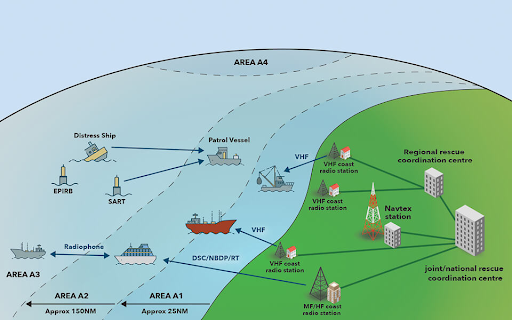

(Q06.01) GMDSS rajonu klasifikācija

A1 - 20 - 30 j.j. -  VHF - DSC  - racija   
A2 - 150 - 180 j.j. - videjo viļņu MF - DSC racijas    
A3 - visi pārējie (ārpus A1 un A2) starp 70 N un 70 S paralēli - Satelīta sakari (Inmarsat)   
A4 - tur kur nesniedz A3 (polārie apgabali)

Ja A4 nestrādā - lieto īsviļņu rāciju   
Ideālais antenas garums ir viļņa garums 

(Q06.02) Radio sakaru aparatūras normas uz jahtām saskaņā ar MK noteikumiem  par atpūtas kuģu drošību.

* D kategorija – viena pārnēsājama VHF šļakatdroša stacija  
* C kategorija – viena stacionāra VHF - DSC stacija + D kat.  
* B kategorija – NAVTEX + pārnēsājama VHF - DSC stacija  
* A kategorija (komerc)  – EPIRB, vidējo viļņu vai INMARSAT + B kat

|  | A  | B  | C  | D |
| :---- | :---- | :---- | :---- | :---- |
| Pārnēsājama VHF  | X  | X  | X  | X |
| Stacionāra VHF DSC  | X  | X  | X |  |
| MF/HF 2182kHz  | X  | +  | + |  |
| Satelītsakaru iekārta INMARSAT  | vai  | vai  | vai |  |
| NAVTEX  | X  | X  | + |  |
| EPIRB  | X  | + |  |  |

X – obligāti   
+ – obligāti tiem, kuri nodarbojas ar komercdarbību Satelītsakaru iekārta aizvieto MF/HF radiostaciju

(Q06.03) Kas ir MSI? MSI izplatīšanas veidi.

MSI - Maritime safety information   
Nodrošina :  UĪV radio ,  MF/HF radio, NAVTEX, INMARSAT, Internets

(Q06.04) Kas ir NAVTEX? Aparatūras veidi, darbības attālums.

NAVigational Teletext- direct to printer info from radio frequency  
Pārraide tiek veikta MF joslā uz 518 kHz   
200 nm (j.j.)  
1998.g.1.aug.

(Q06.05) UĪV sakaru aparatūra. MK noteikumu prasības par UĪV sakariem.

- jābūt pieejamam 16\. kanālam. Frekvence 156.8mhz  
- jābūt vizuālai indikācijai, ka radiostacija ir gatava darbam  
- regulējams skaļums  
- trokšņu regulēšanas iespēja  
- raidītāja jaudas pazemināšanas slēdzis, ja raidītāja jauda var pārsniegt 1 W  
- izstarojuma klase G3E

(Q06.06) DSC un tā principi.

DSC - Digital selective calling, Ciparu izsaukums - ir starptautisks jūras radiosakaru standarts, kas ļauj automatizēti un ātri pārraidīt trauksmes, drošības un ziņojumu izsaukumus, izmantojot VHF, MF un HF joslas. Ļauj : 

* automātiski identificē kuģi ar unikālu MMSI numuru,  
* ļauj nosūtīt trauksmes signālus bez runas,  
* ļauj adresēti (selektīvi) izsaukt citus kuģus vai krasta stacijas,  
* darbojas arī sliktos radiosakaru apstākļos.

Rācijā jābūt ievadītiem parametriem (MMSI) un pieslēgtam GPS, laikam.   
Signāls ir digitāls, ļoti īss un uztverams tālākos attālumos nekā balss.   
Sarkano pogu nospiežun tur kamēr nopīkstas -\> izvēlas avārijas veidu -\> velreiz nospiež tur sarkano pogu . Kad avarijas dienests saņem ziņu viņi atbild ka signāls uztverts.    
   
(Q06.07) Parastas UĪV rācijas atšķirības no DSC rācijas.  
   
Analoga vai digitāla. Digitāla spēj saņemt arī tehnisko info. DSC ļauj nosūtīt ziņu konkrētam MMSI numuram.

(Q06.08) Jūras drošības informācijas (MSI) izplatīšanas veidi.

NAVTEX (A1/ A2 - zona)  
Inmarsat (A3 - zona )  
Racijas  (A1 / A2 / A3 - zona ) - VHF/MF/HF

(Q06.09) Sakaru nodibināšana pa UĪV rāciju. Standarta frāzes angļu valodā.

This is…”, “Over”, “Say again”, “Stand by”, “Roger”, “Wilco”, “Out”, “Mayday”, “Pan-Pan”, and “Sécurité”

(Q06.10) Kas ir MMSI numurs un kas to piešķir jahtām Latvijā.

- Maritime Mobile service identity, piešķir “Elektroniskie sakari”, 9 ciparu numurs. Tiek piešķirts katrai laivai – ieprogrammē iekš iekārtas (DSC) un EPIRB bojai. Katrā iekārtā tiks iedots tas pats numurs. Darbojas kā telefona numurs, kuru var izsaukt.

(Q06.11) Satelītu sakaru sistēmas

INMARSAT - Satlītu sakaru sistēm sastāv no 4x satelītiem  
COSPAS (КОСПАС "Космическая Система Поиска Аварийных Судов") – nodrošina EPIRB boju saziņu, arī A4 teritorijā, 45 satelīti 

(Q06.12) UĪV 16\. kanāls – kam tas ir paredzēts un kā tas tiek pareizi lietots?

Sakaru nodibināšanai un ārkārtas situācijā saziņā ar glābšanas dienestu 

(Q06.13) Glābšanas dienestu izsaukšanas kārtība avārijas gadījumā. Avārijas izsaukuma saturs un kārtība.

#16 kanāls, jāsauc:

MAYDAY , MAYDAY , MAYDAY  (PAMPAM / SECURITE )  
MY CALL SIGN IS … (nav obligāti )  
MAYDAY  
POSITION 45” 36  North , 012” 32 East  
IMMEDIATE ASSISTANCE REQUIRED   
5 persons on board  
OVER

(Q06.14) Ostu kuģu satiksmes dienesti, to uzdevumi un jahtu sakari ar tiem.

Satiksmes organizēšana ostā. Kuģi prasa atļauju ienākt ostā.  Mazās ostās ienākot ir jāprasa atļauja, lielās nav (lasīt lociju).  Kanāls #9

(Q06.15) Rīcība, ja pa radio dzirdams DSC trauksmes signāls.

* piefiksēt kuģa žurnālā visu, kas dzirdēts  
* pārslēgties uz 16\. kanālu un klausīties kasnotiek  
* vajadzības gadījumā pieteikties palīdzēt

(Q06.16) Rīcība, ja pa radio dzirdams avārijas izsaukums ar balsi.

Ja dzird palīdzību ar balsi -\> nav jāatbild   
Palīdzību var sniegt citam līdzvērtīgam kuģim.   
Vai meklējot cilvēku aiz borta.   
Palīgā sauciens ir jāpieraksta kuģa žurnālā un savas kordinātes.

(Q06.17) Fonētiskais alfabēts. Vārdu nosaukšana pa burtiem.

Alfa, bravo, charlie, delta, echo, foxtrot, golf, hotel, india, juliet, kilo, lima, mike, november, oscar, papa, quebec, romeo, sierra, tango, uniform, victor, whiskey, xray, yankee, zulu

(Q06.18) Kuģa koordināšu paziņošana pa rāciju angļu valodā. 

five seven degrees five minutes point five NORTH, yy degress yy minutes point y EAST

(Q06.19) EPIRB. Reģistrācija, kodēšana un sertifikācija.

* ieslēdz briesmu gadījumā, ņem līdz, ūdenī uzpeld, vajag turēt ārpus laivas, jo radiosingāls netiek cauri korpusam.   
* ir hidrostats, kas to ieslēdz noteiktā dziļumā vai saskarē ar ūdeni  
* kodē dīleris, tas veic arī pārējo dokumentāciju  
* reģistrē valsts radio sakari un jūras administrācija

(Q06.20) Izsaukuma signāls (Call Sign), kas to piešķir jahtām Latvijā un kā to lieto.

Izsaukums signāls – piešķir “Elektroniskie sakari”. Latvijā sākas ar YL. Izsaukuma signāls aizvieto jahtas nosaukumu radiosakaros.