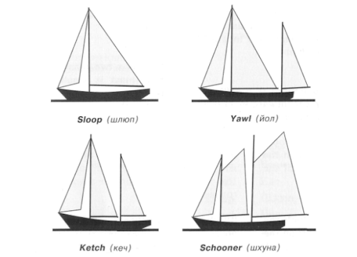
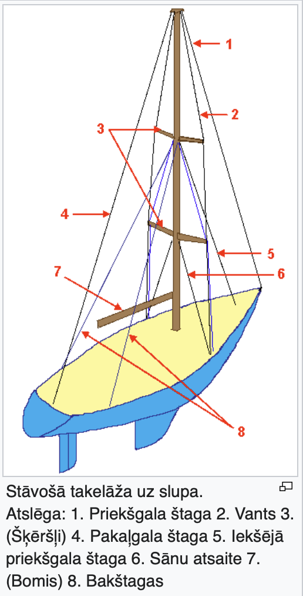
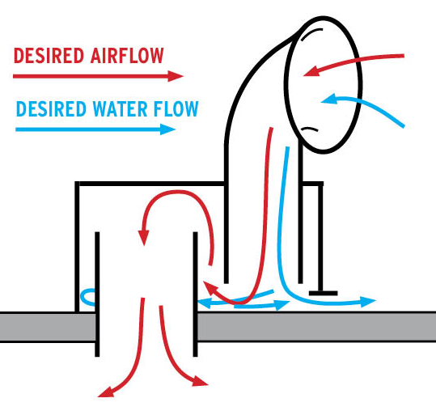
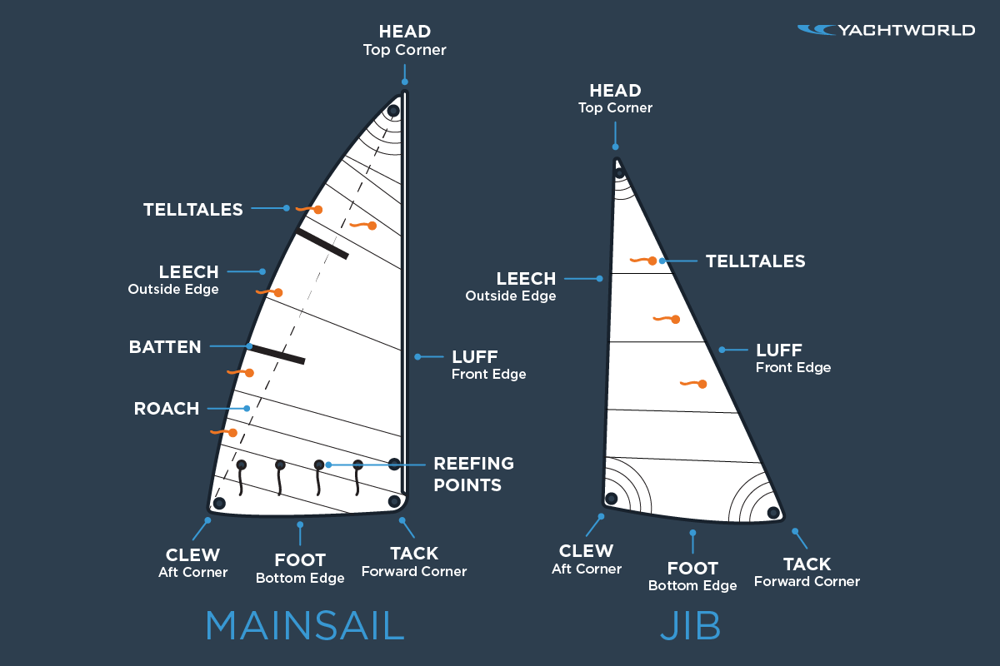

(Q07.01) Jahtu iedalījums pēc korpusa konstrukcijas un takelāžas tipiem.

Pēc dzinēja  tipa :  Motorajahta , Buru jahta   
Pēc korpusu skaita: Vienkorpusa , Daudzkorpusu (katamarāni, trimarāni)  
Pēc ķīļa tipa: Švertlaiva (izbīdāms ķīli jeb šverts), Ķīļjahtas (balastķīlis)   
Pēc korpusa formas: Ūdensizspaida , Glisējošas  
   
Iedalijums pēc takelējuma tipa.

* Slups (Sloop) - 1x masts, 2x buras  
* Kečš (Ketch) - 2 masti (priekš.garāks, aizmugures īsāks – bezanmasts), stūras novietojums aiz bezanmasta (palīgmasta)    
* Jauls (Yawl) - 2 masti , stūre priekšā bezanmastam  
* Šoneris (schooner) -  2 masti (priekšā īsāks, vai abi masti vienāda)

(Q07.02) Slupa takelāža. Stāvošās takelāžas daļas

Nekustīgā takelējuma sastavdaļas

* Masts - vertikāls grākais   
* Zāliņi - horizontāli no masta   
* Vantis - troses no masta gala uz zāliņiem un laivas saniem  
* Štaga - nostiprina mastu peldlīdzekļa diametrālajā plaknē.  
  * Forštagas / ahterštaga – no masta topa sniedzas uz jahtas priekšgalu / pakaļgalu un neļauj masta augšdaļai liekties uz aizmuguri /priekšu  
  * bakštagas – nostiprina mastu vienlaikus uz sāniem un atpakaļvirzienā  
* Grotbomis - 90’ no masta uz aizmuguri   
* Spinakerbomis - no masta uz priekšu   
* Španneri / Vantdzelži 

(Q07.03) Jahtas elektroapgāde, ģenerators, akumulatori, saules baterijas, jahtas ventilācijas sistēma.

Ģenerātori :  Dzinēja ģenerātors , Dīzeļa ģenerātors - 220v  (vairāk elekt), Saules baterijas , Vēja ģenerātors 

MK noteikutmi 3x aķi min : Aķis uz katru motoru , Servia akumulatori, Aķis rācijai , Papildus aķis sānskrūvju un enkuram   

Ventelācijas sistēma : 

* Nodrošina ūens atdalīšanu no gaisa   
* Novērš ūdens ieplūšana laivā 

(Q07.04) Jahtu reliņi un to sastāvdaļas. MK noteikumu prasības attiecībā uz jahtu  reliņiem.

MK nr 210 no 2008 gada 25.marta, reliņu troses nevar būt plastmasas apvalkā, stiprinājuma vieta nav noslēgtas ar uzmavām. Visi reliņu veidojošie elelemnti veido noslēgtu kopumu. 

(Q07.05) Drošības jostas un glābšanas vestes, to lietošana.

Drošības siksna un vestes.

* Piesprādzējas pirms iznāks uz klaja  
* Stirpinājuma punkti piemetināti vai ar skrūvēm  
* Nerūsējoša tērauda stieple (min 5 mm )

Glābšanas vestes : 

* Katrai persona pa vesti.  
* Bērni < 12 g. Vestē visu laiku  
* Pieaugušo vestes (>32 kg) >= 150 N  
* Piepūšamās vestes reiz gadā jānes uz pārbaudi  
* Vestēm ir jābūt marķētām ar kuģa nosaukumu un pieraksta ostu

(Q07.06) Enkuri – to tipi un jahtu apgādes normas attiecībā uz tiem.  
   
Visus atpūtas kuģus, kuru korpusa garums ir lielāks par 24 metriem, un A un B kategorijas atpūtas kuģus, kuru korpusa garums ir 24 metri un mazāks,  aprīko ar diviem enkuriem. Viens enkurs ir lietošanas kartībā. Enkura iekārtu darbina no avarijas enerģijas avot vai manuāli. C un D kat. 24m un mazāk aprīko ar vienu enkuru 

(Q07.07) Buru nosaukumi dažāda tipa jahtām (slups, kečs, jolle, šoneris u.t.t.)

Slupam : 

* Grotbura (no masta uz grotbomja - aizmugurē)  
* Fokbura (Foks, Genua) (no masta uz forštagu - uz priekšu)  
* Spinakeris (Genakers) (no masta uz špinakerbomi - uz priekšu)

Kečam un Jaulam:

* Grotbura  
* Bezanbura (Bezānmasts ir stipri īsāks par grotmastu, tas atrodas aiz stūres pašā jahtas pakaļgalā)  
* Fokbura (Foks, Genua)  
* Spinakeris

(Q07.08) Buru elementi. Kustīgās takelāžas daļas.

Grotburas elementi:

* Buras stūri = Fallstūris (augšējais), Šotstūris (mala), Halzstūris (pie masta);  
* Buras malas: priekšējais, pakaļējais un apakšējais līķis;  
* Latkabatas.  
* Revrindas

Kustīgās takelāžas daļas:

* Falles (paredzētas buru pacelšanai:  
* Šotis (tiek regulēts buras leņķis pret vēju);   
* Dirka (aukla grotbomja noturēšanai);  
* Topenantes (tiek pielietota spinakerbomja noturēšanai);  
* Brasas (spinakerbomja šota, kas iet caur spinakerbomi );  
* Bloki (daudzšķīvju bloku sistāma = taļļa)  
* Vinčas.

(Q07.09) Spinakers. Pacelšana, spinakera vadīšana, novākšana. Ar spinakeru  
saistīto takelāžas elementu nosaukumi.

Spinakers ir ļoti liela laukuma bura (vairāk 150m2). Lai lietotu Spinakeru, vajadzīgs vel viens bomis (Spinakerbomis), kas novietots pretējā pusē grotbomim. To notur topenante. Šote kas iet caur Spinakerbomim ir Brasa. Ar spinakeru jauzmanās vēl vairāk, jo spēcīgā vējā notiek jahtas broučings.  Spinakeru nedrīkst celt bez Grota. Ejot cieši pa vējam var pacelt un nolaist spinakeru aiz grota.  
Spinakera elementi:  spinakers, spinakerbomis, brasa un šote, bloki, falles, bomja atsaites (topenantes) – augšējā un apakšējā.

(Q07.10) Buru jahtas klāja aprīkojums (nosaukumi).

Leitvāga (traveler) - slīdstienis pa kuru garenvirzienā pārvietojas slīdnis vai slīdskava, kuram piestiprināts buras šotstūris;  
Klampa - apkalums galu aizlikšanai;  
Klīze - parastiu cauruļveida apkalums, kas pasargā tauvošanās galus no berzes;  
Vantdzelzis - apkalums vanšu piestiprināšanai pie jahtas;  
Reliņi - sēta apkārt borta malām;  
Viņčas;  
Bloki - izmaina auklas kustības virzienu;  
Enkurviņča - 

(Q07.11) Atpūtas kuģu kuģošanas rajonu un attiecīgās konstrukcijas kategorijas. 

D - iekšējo ūdeņu jahtas , viļņi 0,3 M  
C - slēgtās Jūras, piekrastes jahtas, viļņi līdz 2m  
B - Atklātās jūras, viļņi līdz 4m  
A - bez ierobežojuma, viļņi virs 4m

| Uzbūves kategorija | Vēja stiprums (balles pēc Boforta skalas) | Nozīmīgs viļņu augstums (H 1/3, metri) |
| :--- | :--- | :--- |
| A | vairāk nekā 8 | vairāk nekā 4 |
| B | līdz 8 (ieskaitot) | līdz 4 (ieskaitot) |
| C | līdz 6 (ieskaitot) | līdz 2 (ieskaitot) |
| D | līdz 4 (ieskaitot) | līdz 0,3 (ieskaitot) |

(Q07.012) Jahtas aprīkojuma normas par ūdens atsūknēšanas ierīcēm.

Jābūt 2 sūkņi uz katru ūdens necaurlaidīgo telpu. Viens automātiskais un viens mehāniskais sūknis. Automātiskie sūkņi jāaprīko ar skaņas vai gaismas signalizāciju.

(Q07.13) Jahtas apgādes normas ar pirotehniskajiem līdzekļiem. To lietošana.

Pirotehnika: 

* Oranžš dūmu signāls - deg 4 min., met pāri bortam, lieto dienā (A-2, B-2, C-vien.korp-2, C-daudz.-korp )   
* Sarkana signala lāpa - tur rokā, lieto naktī (A-4, B-4, C-vien.korp-4, C-daudz.-korp-4 )  
* Sarkana izpletņ raķete - šauj pa vēju (A-6, B-4, C-dudz.korp-2)

| Kuģa kategorija | Sarkanas izpletņraķetes | Sarkanas rokas signāllāpas | Oranžs dūmu signāls |
| :--- | :---: | :---: | :---: |
| A | 6 | 4 | 2 |
| B | 4 | 4 | 2 |
| C vienkorpusa | - | 4 | 2 |
| C daudzkorpusu | 2 | 4 | 2 |

(Q07.14) Vētras enkuri, to lietošana.

Vētras enkuri (Sea Anchor) : 

* Lai pagrieztu jahtu pa / pret viļņiem  
* Atkarībā no korpusa lieto caur foru vai ahteri  
* Stiprina lai iztur lielas slodzes.

(Q07.15) Ugunsdzēsības inventārs uz atpūtas kuģiem. Ugunsdrošība kambīzē.

A, B un C kategorijas buru kuģus aprīko ar vismaz 2 pulvera vai putu ugunsdzēsības aparātiem, kas atrodas uz kuģa viegli pieejamās vietās. Apjoms vismaz 7 L putu vai 3,8 kg pulvera.

(Q07.16) Jahtas ieziemošana un uzglabāšana ziemā.  
Pirms ieziemošanas uztaisa defektāciju, jahtu jāceļ no ūdens, iekštelpās ievieto sāls granulas, noņem akumulatoru klemmas, notīra, nokrāso ar neapaugošo krāsu.

(Q07.17) Avārijas materiāli, instrumenti un rezerves daļas uz atpūtas kuģiem

Pamatinstrumentu komplekts  
Knaibles, lai atbrīvotos no nolauzta masta  
Pelēkā līmlenta  
Piedziņas siksnas, rezerves degvielas filtrs, ūdens sūkņa rotoriņš  
Buru līmlentes, šūšanas materiāli  
Avārijas stūre.

(Q07.18) Prasības atpūtas kuģiem attiecībā uz glābšanas plostiem.

Glābšanas plosti : 

* A un B kategorijas atpūtas kuģi un C kat. atpūtas komerc. Kuģiem jābūt aprīkotiem ar plostiem, visiem ekipāžas loc.    
*  A kat kuģiem -> SOLAS konvencijas prasībām “A pack”  
* B un C kat. Kuģiem -> SOLAS konv. “B pack”  
* Plosti kas smagāki par 40 kg novieto tā lai to var ievilkt vai iestumt jūrā. 

(Q07.19) Jahtas aprīkojums ar navigācijas ugunīm atkarībā no garuma un tipa.

Navigācijas ugunis un signāli :

* A, B, C un D kat. kuģiem garākiem par 12 m aprīko ar skaņas signālu (miglas turi), pārējās aprīko ar ierīcēm skaņas radīšanai.  
* Navigācijas ugunis atbilstoši COLREG  
* Avārijas uguņu komplekts  
* Rezerves zaļā / sarkanā / baltā lmapiņa

(Q07.20) Jahtas avārijas stūre.

* stūres grozīklis, ko ir iespējams uzlikt uz stūres vārpstas gala;  
*  airis stūrēšanai (nepieciešmības gadījumā var izgatavot no pieejamiem materiāliem uz jahtas);  
*  motorjahtām jaudas sadale starp dzenskrūvēm, ja kuģis ir aprīkots ar divām dzenskrūvēm (motoriem)

