(Q08.01) Sasiet plakano mezglu, pālstēku un enkura mezglu.

Plakanais mezgls (Square knot) - divu virvju savienošanai   
Pāļstēks (Bowline) - glābšanas darbiem, sasiet kaut ko kopā   
Enkurmezgls (Anchor hitch) - pievienot galu cilpai 

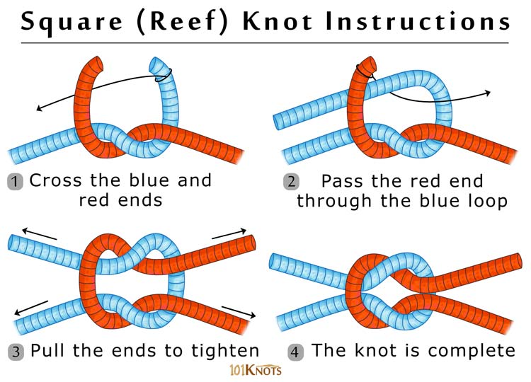

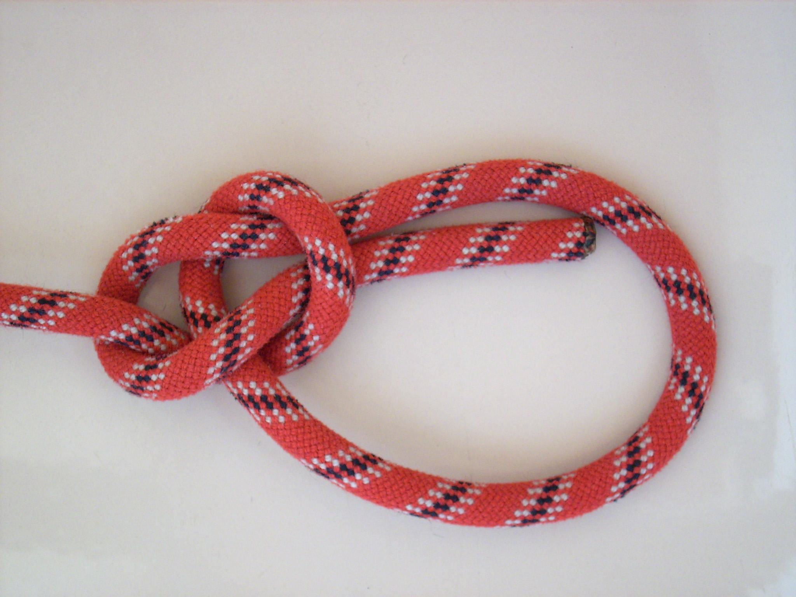

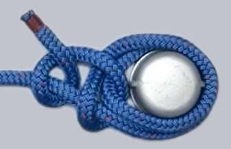

(Q08.02) Sasiet šotes mezglu, vebliņstēku un vienkāršo stēku.

Šotes mezgls (Sheet knot) - dažādiem garumu savienošanai   
Vebliņstēks (Clove knot) - virvi piestiprina pie stieņa / margas  pāļa  
Vienkāršo stēku (Double half hitch) - stiprinājums pie margas 

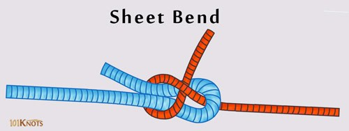

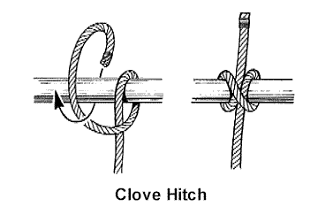

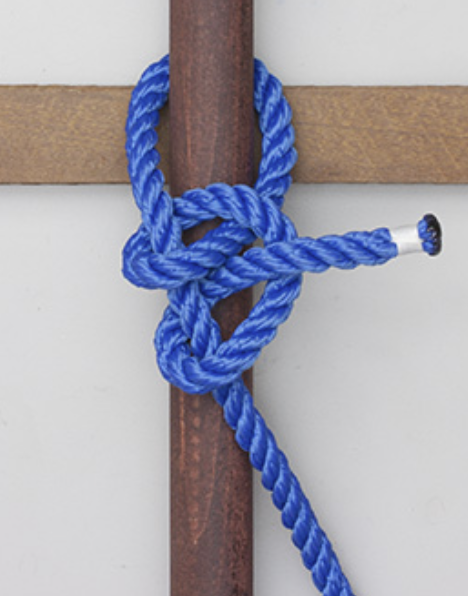

(Q08.03) Sasiet dubulto šotes mezglu, dubulto pālstēku un aizturstēku.

Dubulto šotes mezglu (Double sheet bend)  
Dubulto pālstēku (Bowline on a bight)  
Aizturstēku (Stopper hitch / Rolling hitch) 

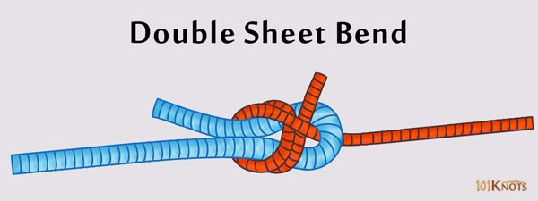

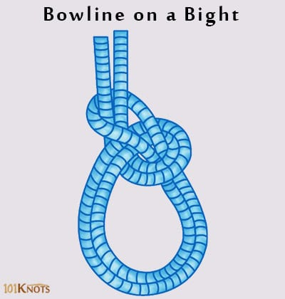

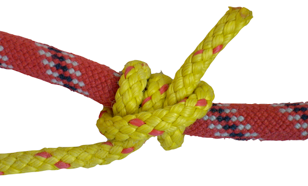

(Q08.04) Sasiet rēvmezglu, dubulto vebliņstēku, dubulto stēku.

Rēvmezgls (slipped reef knot)  
Dubultas vebliņstēks (Double constrictor)  
Dubulto stēku (Round turn and two half hitch)

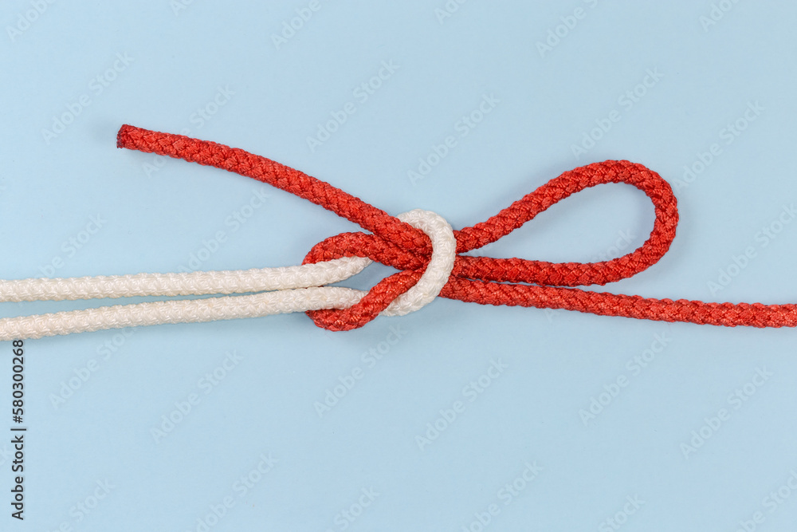

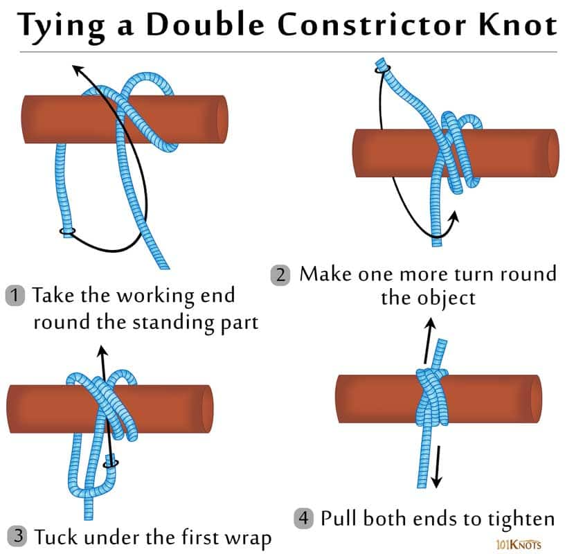

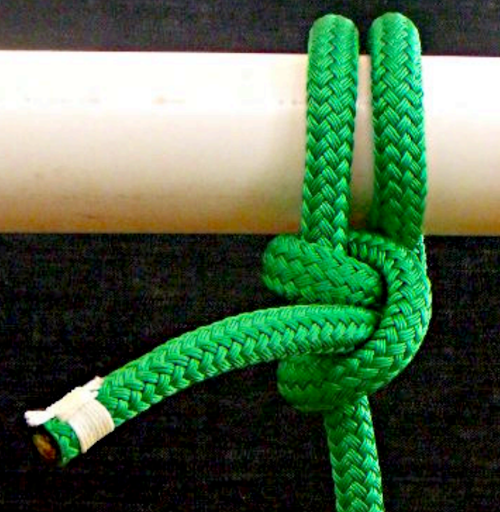

(Q08.05) Sasiet astoņnieku, pusstēku un vienkāršo tākeliņu.

(Q08.06) Nostiprināt galu uz jahtas klampas.

(Q08.07) Uzlikt piesienamā gala augu (cilpu) uz piestātnes klampas.

(Q08.08) Buru kopšana un remonts: buru audumi, buras remonta pamatoperācijas, buru adatas un diegi.

Buras iedalijums pēc materiāla: 

* Laminētā  
* Sintētiskā  
* Austas   
* Dabisks 

Buras remonts : šūšana vai līmēšana   
Kādi instrumenti : buru adta (T -veida), diegs, bocmaņa cimts, šķēres 

Buru kopšana : izžāvē , mazgā ar neagresīviem līdzekļiem 

(Q08.09) Buru remonta iespējas uz jahtas jūrā.

līmēt (sausa , attaukota, ielāpi no abām pusēm ), krastā ielāpus nošuj 

(Q08.10) Kā aizmest piesienamo galu pēc iespējas tālāk?

Sviedrlīte (tievs striķis ar bumbu galā )  
Vai sadala divās daļā un met vienu daļu. 

(Q08.11) Tērauda troses un to veidi

Terauda troses iedalās : 

* cietās (nelokās) - vantis, štagas, reliņi     
* mīkstās (lokās) - sture, var sapīt 

(Q08.12) Sasiet dubulto šotes mezglu, vebliņstēku un aizturstēku.

(Q08.13) Kā sakārtot galus un buras uz jahtas pie piestātnes un pārgājiena laikā?

Sakailēm (buhtavat : ru ) - satin galus 

(Q08.14) Dažādu materiālu galu īpašības. Kādiem raksturlielumiem jāpievērš uzmanība mainot dažādus galus jahtai?

Divu veidu gali vītie un pītie.  
Var būt no dabīgām šķiedrām (kaņepes) un sintētiskām (kaprons, kevlars, ).  
Galu iedalijumi : 

* Statiskie (falles)  
* Dinamiskie (piesienamie gali, šotes)  
* un daļēji dinamiskie

Iedala vel : peldošie (glābšanas rinķim, galie gli uz krastu), nepeldošie  
Rakstura lielumi kam jāpievērš uzmanība : diametrs 

(Q08.15) Kam jāpievērš uzmanība pārbaudot jahtas takelāžu?

Pārbauda reizi gadā  - min, bet pēc grūtiem braucieniem arī. Skatas vai nav nodilis. vaļā. Trose neplīst pa vidu bet pie stiprinājumiem.  

(Q08.16) Dažādu buru sakārtošana un buru glabāšana.

Saloka liek maisā, novieto sausā ventelējamā vietā.  

(Q08.17) Kā pareizi sagatavot piesienamos galus pirms  pietauvošanās?

Izjaucam, sakailējam, piestirpinam vienu galu pie laivas. 

(Q08.18) Kā var ar mazāk izturīgu galu pacelt smagāku kravu?

Ar trīšu sistēmu 

(Q08.19) Kā iedalās gali uz jahtas pēc nosaukumiem?

Pēc pielietojuma. Fals, šoti, atsaites,  utt. 

(Q08.20) Takeliņi (markas), to izpildes tehnika.

Divu veidu : šūtie un nešūtie

