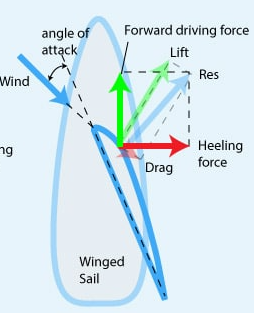

(Q09.01) Gaisa spiediena sadalījums uz buras. Rezultējošā aerodinamiskā spēka iedarbība uz buru, tā sadalīšana komponentēs

GPT: 

Kad vējš pūš burā :   
1) Vēja pusē - gaisa plūsma pāri burai pārvietojas ātrā (Saskaņā ar bernulī ātrāka plūsma = mazāks spiediens)   
2) Pretvēja pusē - plūsma ir lēnāka, lielāks spiediens 

Resultējošais spēks = R (perpendikulārs buras plaknei )

Spēku sadalīšana komponentēs : 

* Pacelšanas spēks (Lift, L)  
* Pretestība (Drag, D)

(Q09.02) Buras savērpe. Jahtas sānsveres iespaids uz jahtas gaitu. 

Buras saverpums ir slikts , grotbomja atsaite traucē saverpt buru 

(Q09.03) Buras "pagarinājums", tā induktīvā pretestība.

GPT:   
“Pagarinājums” (aspect ratio) - raksturo buras ģemoetrisko formu (augstuma, platuma attiecību)  
AR = h 2(kvad)/A , kur h- buras austums , A - Buras laukums 

Buras pagarinājums ietekmē induktīvo pretestību. 

* Lielāks pagarinājums (augsta, šaura bura) - mazāka induktīvā pretestība, jūtīga pret masta izliekumu  
* Mazāks pagarinājums (zema plata bura) - liela induktīvā pretestība 

(Q09.04) Jahtas induktīvā pretestība, formas pretestība.

GPT :  
Formas pretestība - rodas no jahtas formas (garums , platums), virpuļi aiz jahtas, ātruma - mazāka pretestība slaidiem korpusiem ar gludām virsmām.   
Induktīvā pretestība (induced drag) - Rodas no sānu spēkiem, kas rodas, kad bura vai ķīlis rada pacēluma spēku.  
Berzes pretestība -   
Ūdens berzes pretestība - 

Induktīvā pretestība - buras galā augstais spiediens satiekas ar zemo spiedienu vedojas virpulis. 

(Q09.05) Uzzīmēt jahtas aerodinamisko spēku vektorus kursā pie vēja.

Lift (L- en., V - lv  ) - Aerodinamiskā celtspēja: Spēks, kas darbojas perpendikulāri šķietamajam vējam. Šis ir galvenais spēks, kas virza laivu uz priekšu, līdzīgi kā lidmašīnas spārna profils.  
Drag (D) - Aerodinamiskā pretestība: Spēks, kas darbojas šķietamā vēja virzienā. Šis spēks pretojas buras kustībai gaisā.  
Res (R) - bures rezultējošā aerodinamiskā spēka vektors   
Wind (vējš) -   
Ķīlis - 

(Q09.06) Iespējamie jahtas kursi attiecībā pret vēju un attiecīgais buru regulējums.

GPT : Iet nevar, pie vēja 40-45 “ var mēģināt (grotbura pievilkta pie viduss līnijas, genuja / fokbura- cieši pievilkta pie vantīm 

(Q09.07) Jahtas centrēšanas principi: buras laukuma smaguma centrs (BC); laterālā laukuma smaguma centrs (LC); jahtas trimēšana, kursa noturība.

GPT:  
Jahtas centrēšanu nosaka attiecības starp buru laukuma smaguma centru (BC, angl. CE — Center of Effort) un laterālā laukuma smaguma centru (LC angl. CLR — Center of Lateral Resistance) : 

* BC ir punkts, kurā iedarbības rezultējošais aerodinamiskais spēks no burām  
* LC ir punkts, kurā iedarbības rezultējošais hidrodinamiskais spēks no korpusa un ķīļa

(Q09.08) Foka un grota savstarpējā iedarbība.

GPT: foka plūsma ietekmē gaisu ap grotu un otrādi.  
Kad vējš plūš uz foka aizmugurējo malu un grota priekšējo malu (gaisma plūsma paātrinās, spiediens samazinās - grots efektīvāks ).   
Ffoks + grots kopā rada lielāku rezultējošo aerodinamisko spēku.

(Q09.09) Jahtas lūvēšanās un krišanās. Jahtas sānsveres iespaids uz lūvēšanos.

Lūvēšanās (angliski luffing up) nozīmē jahtas pagriešanos ar priekšgalu tuvāk vējam. Iemesli - priekšējās buras laukuma samazināšanās, parāk atbrīvota grota.   
Krišanās (angliski falling off) nozīmē, ka jahta pagriežas ar priekšgalu prom no vēja. Iemesls - pārāk cieš grots attiecībā pret foku 

Sānsvere (heeling) rada spēcīgāku spēka momentu ap jahtas vertikālo asi, kas griež priekšgalu pret vēju.

(Q09.10) Jahtas stabilitātes principi. 

Divi centri : 

- smaguma centrs   
- celej spēks  - veidojas iespiežot zem ūdens gaisu 

Laivu sakantējot - veidojas plecs , smaguma centrs nemaina savu vietu, celējspēks maina vietu.   
Kreisera jahta ir stabilākais peld līdzeklis, smaguma centrs ir zem ūdens   
Jahtu bez viļņiem ar vēju apgāzt nevar.   
Ķīlies ˜ 40 % no jahtas svara 

(Q09.11) Turbulentā un laminārā ūdens plūsma.

GPT :   
Laminārā plūsma - Ūdens daļiņas pārvietojas kārtainos, paralēlos slāņos, un kustība notiek vienmērīgi un sakārtoti, pa gludu virsmu, augsta šķidruma viskozitāte. 

Turbulentā - Ūdens daļiņu kustība ir haotiska, veidojas virpuļi un sajaukšanās-  liels ātrums, liels šķērsgriezums, vai zema viskozitāte.

(Q09.12) Jahtas korpusa veidoto viļņu mehānisms. Divu viļņu teorija. Glisēšana. Ūdenslīnijas ietekme uz viļņu veidošanos.

** Divu viļņu teorija ** 

Glisēšana - ir slīdēšana pa ūdens virsmu neveidojot vilni.   
Lai laiva var glisēt dibenam jābūt plakanam

GPT : Frauda skitlis raksturo jahtas kustību pret viļņa veidošanos - ļauj saprast vai jahta pārvietojas izspiešanas režīmā vai glīsēšanas režīmā. 

Fr = v/(sakne(g*L))  
Fr - Fruda skaitlis (> 0.8 = glisēšana, < 0.3 izspiešana)  
g- brivās krišanas paātrinājums (~9.81 m/s2 )  
L - viļņa garums   
v - jahtas ātrums 

GPT : Ūdenslīnijas garums un forma būtiski nosaka viļņu veidošanās raksturu. Garāka ūdenslīnija -> jaht var sasniegtaugstāku ātrumu

(Q09.13) Driftes pretestība. Ķīļa un stūres pagarinājums, induktīvā pretestība.

Jo garāks ķīlis jo lielāka induktīvā pretestība ? 

GPT :   
Liels pagarinājums (dziļš - šaurs) - mazāka induktīvā pretestība (efektīva pret driftēšanu)  
Mazs pagarinājums (sekls - plats) - lielāka induktīvā pretestība    
Līdzīgi stūrei. 

Driftes pretestība rodas, kad jahta brauc ar nelielu sāndriftu   
Kad vējš pūš uz buru, buras radītais rezultējošais aerodinamiskais spēks sadalās: 
1) vilkmes komponentē (virza jahtu uz priekšu), 
2) sānu komponentē (cenšas jahtu nogāzt un novirzīt sānis). 
Šo sānu spēku līdzsvaro hidrodinamiskais spēks, ko rada ķīlis, stūre un korpuss zem ūdens. Šajā procesā rodas driftes pretestība – jeb pretestība pret kustību sānis, ko izraisa ūdens plūsmas novirze ap ķīli un stūri.

(Q09.14) Jahtas lūvēšanās un kā to novērst?

GPT: Jahtas lūvēšanās ir parādība, kad jahta pati griežas pret vēju. Rodas kad pārāk liela bura (grots), slikti trimēta (pakaļa pārāk dziļi ūdenī)  
Labo : samazinot grota laukumu, palielinot foku 

(Q09.15) Gaisa plūsmas cirkulācija ap burām. Induktīvā plūsma

Kad vējš plūst gar buru tas sadalās divās daļās  
 – viena daļa aptek buras vējpuses (iekšpuses) plūsma ir lēnāka → spiediens lielāks  
 – lejasvēja puses (burai izliekuma pusē) gaisa plūsma ir ātrāka → spiediens mazāks.

(Q09.16) Kas ir vimpeļvējš? Pie jahtas ātruma 10 mezgli un pie vēja ātruma 30 mezgli ejot kursā ar vēju, kāds būs vimpeļvējš ? 

Vimpeļvējš ir divu vektoru summa : īstais vējš (pūš attiecībā pret zemi) + laivas parvietošanās vējš (pretējā virzienā), buras regulē pēc vimpeļvēja.  
30 -10 = 20 mezgli 

(Q09.17) Buru izvēle atkarībā no vēja stipruma. Buru trimmēšana atkarībā no vēja stipruma un virziena.

 0-10 mezgli (vējš) - pilna grota + liela genua + spinakeris   
10-20 mezgli - pilna vai nedaudz reducēta grota, mazāka genua  
20-30 mezgli - 2. vai 3. rifējums grotai, vētras fok, bez lielām papildburām

Trimmēšana:   
Asi pret vēju (Close-hauled ~ 30”), foka / genua (cieši pievilkta), grota (cieši pievilkta)  
Ass blakstūre (Close reach ~ 60”), foka / genua (nedaudz vaļīgāka), grota (nedaudz vaļīgāka)  
Sānvējš (Beam reach ~ 90), foka / genua (vaļīgāka), grota (vaļīgāka)  
Plašs baksstūris (Broad reach, ~120”), foka / genua (vaļīgāka), grota (vaļīgāka)  
Ar vēju(Running), grota (vaļā līdz 90”)

(Q09.18) Jahtas vadīšana ar spinakeru. Broučings.

Lieto ejot pa vēju (jāpaceļ ātri).   
Ļoti sarežģīts vadībā.   
Spinakers simetrisks.   
Augšējais sturis - falstūtis   
Apakšējie šort sturis 2x   
Virsvēja pusē bomis (divas atsaites)   
Gali - Brasa (virsvēja), šote (zemvēja stūris ) + viņča  
Buru jāpaceļ grota aizvējā 

Broučings (broaching)  ir laivas neprognozēta pagriešanās . 

(Q09.19) Rēvēšanās.

Rēvēšanas buras luakuma samazināšana   
Foka sarulēšana   
Rev rinda   
šot sturis (ārējais stūris - velk ar virvi  ) - halzes sturis (piem masta - velk ar rokā)   
Piesiešanas caurumi - sasien ar rev mezgliem   
Revejas cieši pie vēja    
Reivēt var viens ar mo viņču un spec reiv meh.   
Parasti ir 3x rēves 

(Q09.20) Masta izliekuma izmantošana buru trimmēšanai  
Masts salokas kā loks , grot bura paliek plakanāka vai vēderaināku, ejot pie vēja izdevīgāk 

** Vēras buras **

Mazs fogs   
Grots  - trisele  (bez grot bomja, jo grot bura ir nolaista), stiprina tikai mastā    
No bieza matereāla , no dzeltena materiāla 

